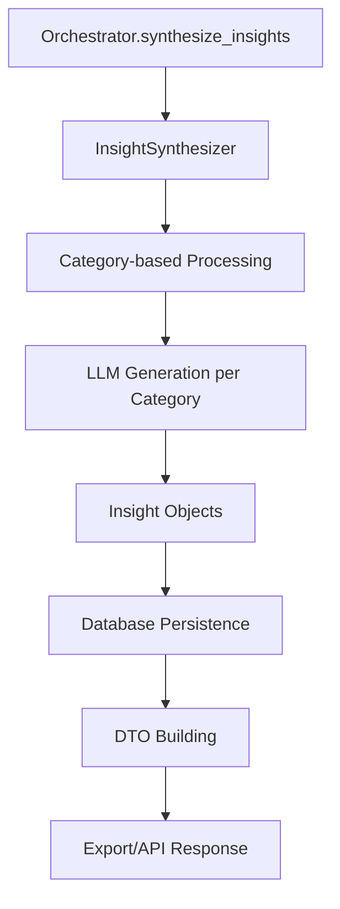
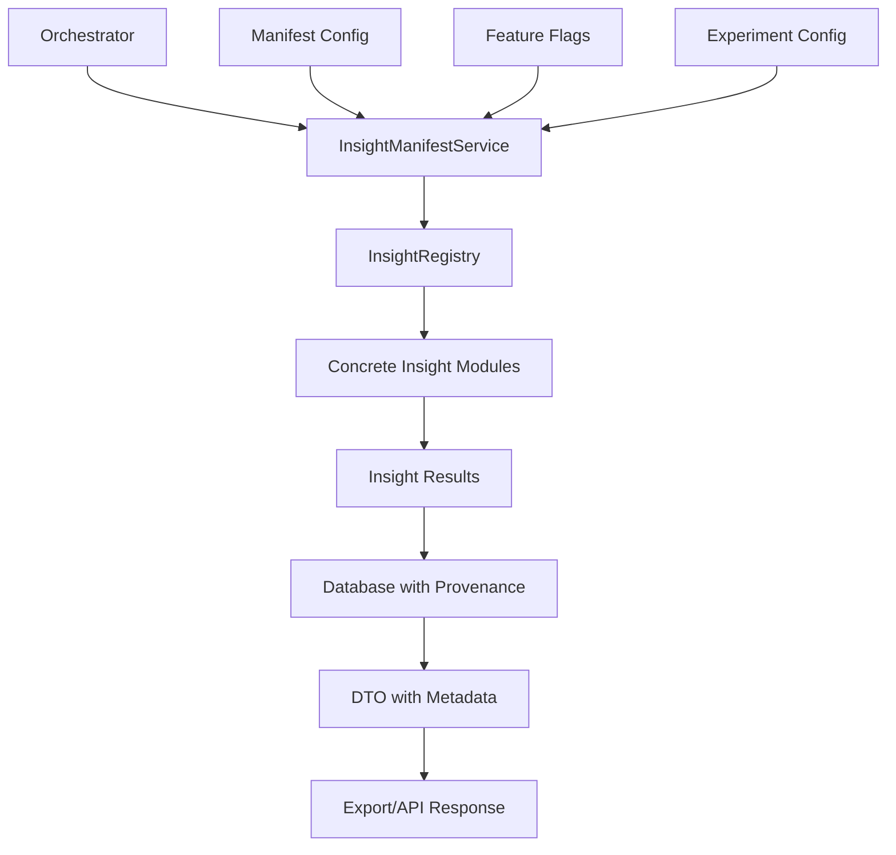

# 🧠 HealthIQ-AI v5 - Insight Modularity Architecture Review

> **Purpose**: Comprehensive analysis of current insight architecture and proposal for modular, plug-and-play insight system

---

## 📊 **AS-IS Architecture Analysis**

### **Current Insight Generation Flow**



### **Key Components**

#### **1. InsightSynthesizer (`backend/core/insights/synthesis.py`)**
- **Current Approach**: Category-based synthesis (metabolic, cardiovascular, inflammatory, etc.)
- **LLM Integration**: Uses GeminiClient or MockLLMClient for each category
- **Output**: Generic `Insight` objects with normalized categories
- **Limitations**: 
  - No modular insight discovery
  - Hard-coded category processing
  - No versioning or A/B testing support
  - No manifest-driven configuration

#### **2. Insight Registry (`backend/core/insights/registry.py`)**
- **Current State**: Basic registry exists but **NOT USED** by orchestrator
- **Capabilities**: Can register `BaseInsight` classes
- **Gap**: No integration with synthesis pipeline
- **Missing**: No manifest system, no versioning, no feature flags

#### **3. BaseInsight Contract (`backend/core/insights/base.py`)**
- **Current Contract**: 
  ```python
  class BaseInsight(ABC):
      def get_required_biomarkers(self) -> List[str]
      def analyze(self, context: AnalysisContext) -> List[BiomarkerInsight]
      def get_insight_name(self) -> str
      def get_insight_category(self) -> str
      def can_analyze(self, context: AnalysisContext) -> bool
  ```
- **Gap**: Contract exists but no concrete implementations found
- **Missing**: No versioning, no manifest metadata, no experiment support

#### **4. Database Schema (`backend/core/models/database.py`)**
- **Current Insight Table**:
  ```sql
  CREATE TABLE insights (
      id UUID PRIMARY KEY,
      analysis_id UUID NOT NULL,
      insight_type VARCHAR(50) NOT NULL,  -- Generic type field
      category VARCHAR(50) NOT NULL,      -- Hard-coded categories
      title VARCHAR(200) NOT NULL,
      content TEXT NOT NULL,
      -- ... other fields
  );
  ```
- **Gap**: No fields for `insight_id`, `version`, `manifest_id`, `experiment_id`
- **Missing**: No insight manifest table, no versioning support

#### **5. DTO Building (`backend/core/dto/builders.py`)**
- **Current Approach**: Generic insight DTO building
- **Gap**: No insight-specific metadata (version, manifest, experiment)
- **Missing**: No insight provenance tracking

### **Critical Gaps Identified**

1. **No Modular Insight Discovery**: Registry exists but not used
2. **No Manifest System**: No configuration-driven insight selection
3. **No Versioning**: No support for insight v1, v2, etc.
4. **No A/B Testing**: No experiment framework
5. **No Provenance**: No tracking of which insight/version was used
6. **Hard-coded Categories**: Categories are hard-coded in synthesis
7. **No Concrete Implementations**: No actual insight modules found

---

## 🎯 **TO-BE Architecture Proposal**

### **Modular Insight System Design**



### **1. Enhanced Insight Contract**

```python
from abc import ABC, abstractmethod
from typing import List, Dict, Any, Optional
from dataclasses import dataclass
from enum import Enum

class InsightSeverity(Enum):
    INFO = "info"
    WARNING = "warning"
    CRITICAL = "critical"

@dataclass
class InsightMetadata:
    insight_id: str
    version: str
    category: str
    required_biomarkers: List[str]
    description: str
    author: str
    created_at: str
    updated_at: str
    experimental: bool = False

class BaseInsight(ABC):
    """Enhanced base class for modular insights."""
    
    @property
    @abstractmethod
    def metadata(self) -> InsightMetadata:
        """Return insight metadata including ID, version, etc."""
        pass
    
    @abstractmethod
    def analyze(self, context: AnalysisContext) -> List[Insight]:
        """Analyze context and generate insights."""
        pass
    
    def can_analyze(self, context: AnalysisContext) -> bool:
        """Check if insight can analyze the given context."""
        required = set(self.metadata.required_biomarkers)
        available = set(context.biomarker_panel.biomarkers.keys())
        return required.issubset(available)
    
    def get_insight_id(self) -> str:
        return self.metadata.insight_id
    
    def get_version(self) -> str:
        return self.metadata.version
    
    def get_category(self) -> str:
        return self.metadata.category
```

### **2. Insight Manifest System**

```python
@dataclass
class InsightManifest:
    manifest_id: str
    version: str
    name: str
    description: str
    active_insights: List[InsightConfig]
    experiments: List[ExperimentConfig]
    created_at: str
    updated_at: str

@dataclass
class InsightConfig:
    insight_id: str
    version: str
    enabled: bool
    weight: float = 1.0
    experiment_id: Optional[str] = None

@dataclass
class ExperimentConfig:
    experiment_id: str
    name: str
    enabled: bool
    traffic_percentage: float
    variants: List[InsightVariant]
    start_date: str
    end_date: Optional[str] = None

@dataclass
class InsightVariant:
    insight_id: str
    version: str
    weight: float
```

### **3. Enhanced Database Schema**

```sql
-- Insight manifests table
CREATE TABLE insight_manifests (
    id UUID PRIMARY KEY DEFAULT gen_random_uuid(),
    manifest_id VARCHAR(100) UNIQUE NOT NULL,
    version VARCHAR(20) NOT NULL,
    name VARCHAR(200) NOT NULL,
    description TEXT,
    active BOOLEAN DEFAULT true,
    created_at TIMESTAMP WITH TIME ZONE DEFAULT NOW(),
    updated_at TIMESTAMP WITH TIME ZONE DEFAULT NOW()
);

-- Insight configurations table
CREATE TABLE insight_configs (
    id UUID PRIMARY KEY DEFAULT gen_random_uuid(),
    manifest_id VARCHAR(100) NOT NULL REFERENCES insight_manifests(manifest_id),
    insight_id VARCHAR(100) NOT NULL,
    version VARCHAR(20) NOT NULL,
    enabled BOOLEAN DEFAULT true,
    weight FLOAT DEFAULT 1.0,
    experiment_id VARCHAR(100),
    created_at TIMESTAMP WITH TIME ZONE DEFAULT NOW(),
    UNIQUE(manifest_id, insight_id, version)
);

-- Enhanced insights table
CREATE TABLE insights (
    id UUID PRIMARY KEY DEFAULT gen_random_uuid(),
    analysis_id UUID NOT NULL REFERENCES analyses(id),
    insight_id VARCHAR(100) NOT NULL,  -- e.g., "metabolic_age_insight"
    version VARCHAR(20) NOT NULL,      -- e.g., "v1.2.0"
    manifest_id VARCHAR(100) NOT NULL, -- e.g., "production_v1"
    experiment_id VARCHAR(100),        -- e.g., "fatigue_ab_test_2024"
    category VARCHAR(50) NOT NULL,
    title VARCHAR(200) NOT NULL,
    content TEXT NOT NULL,
    confidence FLOAT,
    severity VARCHAR(20),
    biomarkers_involved TEXT[],
    evidence JSONB,
    recommendations TEXT[],
    created_at TIMESTAMP WITH TIME ZONE DEFAULT NOW()
);
```

### **4. Insight Manifest Service**

```python
class InsightManifestService:
    """Manages insight manifests and configuration."""
    
    def __init__(self, db_session):
        self.db = db_session
        self.registry = InsightRegistry()
    
    def get_active_manifest(self) -> InsightManifest:
        """Get the currently active manifest."""
        # Implementation to fetch from database
        pass
    
    def get_insights_for_analysis(self, context: AnalysisContext) -> List[BaseInsight]:
        """Get insights to run for a specific analysis context."""
        manifest = self.get_active_manifest()
        insights = []
        
        for config in manifest.active_insights:
            if config.enabled and self._should_run_insight(config, context):
                insight = self.registry.get_insight(config.insight_id, config.version)
                insights.append(insight)
        
        return insights
    
    def _should_run_insight(self, config: InsightConfig, context: AnalysisContext) -> bool:
        """Determine if insight should run based on experiments and context."""
        # A/B testing logic, feature flags, etc.
        pass
```

### **5. Concrete Insight Modules**

```python
# Example: Metabolic Age Insight
class MetabolicAgeInsight(BaseInsight):
    @property
    def metadata(self) -> InsightMetadata:
        return InsightMetadata(
            insight_id="metabolic_age_insight",
            version="v1.2.0",
            category="metabolic",
            required_biomarkers=["glucose", "hba1c", "insulin", "age"],
            description="Calculates biological age based on metabolic markers",
            author="HealthIQ Team",
            created_at="2024-01-15T00:00:00Z",
            updated_at="2024-01-30T00:00:00Z"
        )
    
    def analyze(self, context: AnalysisContext) -> List[Insight]:
        # Implementation of metabolic age calculation
        pass

# Example: Fatigue Root Cause Insight
class FatigueRootCauseInsight(BaseInsight):
    @property
    def metadata(self) -> InsightMetadata:
        return InsightMetadata(
            insight_id="fatigue_root_cause",
            version="v2.1.0",
            category="lifestyle",
            required_biomarkers=["iron", "b12", "thyroid_tsh", "cortisol"],
            description="Identifies root causes of fatigue",
            author="HealthIQ Team",
            created_at="2024-01-20T00:00:00Z",
            updated_at="2024-01-30T00:00:00Z"
        )
    
    def analyze(self, context: AnalysisContext) -> List[Insight]:
        # Implementation of fatigue analysis
        pass
```

---

## 🚀 **Implementation Phases**

### **Phase 1: Foundation (Sprint 9c)**
**Duration**: 2 weeks
**Goal**: Establish modular insight infrastructure

#### **Tasks**:
1. **Enhanced BaseInsight Contract**
   - File: `backend/core/insights/base.py`
   - Add `InsightMetadata` dataclass
   - Enhance `BaseInsight` with versioning and metadata

2. **Database Schema Updates**
   - File: `backend/migrations/versions/insight_modularity_schema.py`
   - Add `insight_manifests` table
   - Add `insight_configs` table
   - Enhance `insights` table with provenance fields

3. **Insight Manifest Service**
   - File: `backend/services/insights/manifest_service.py`
   - Implement manifest management
   - Add database operations

4. **Enhanced Registry**
   - File: `backend/core/insights/registry.py`
   - Add version-aware insight resolution
   - Add manifest integration

#### **Deliverables**:
- Enhanced insight contract with versioning
- Database schema for manifests and provenance
- Basic manifest service
- Updated registry system

### **Phase 2: Concrete Implementations (Sprint 9d)**
**Duration**: 2 weeks
**Goal**: Create concrete insight modules

#### **Tasks**:
1. **Core Insight Modules**
   - File: `backend/core/insights/modules/metabolic_age_insight.py`
   - File: `backend/core/insights/modules/fatigue_root_cause.py`
   - File: `backend/core/insights/modules/detox_filtration.py`
   - File: `backend/core/insights/modules/silent_inflammation.py`
   - File: `backend/core/insights/modules/heart_insight.py`

2. **Module Registration**
   - File: `backend/core/insights/modules/__init__.py`
   - Auto-register all modules
   - Add module discovery

3. **Default Manifest**
   - File: `backend/data/insight_manifests/default.json`
   - Create production manifest
   - Configure all core insights

#### **Deliverables**:
- 5+ concrete insight modules
- Auto-registration system
- Default production manifest
- Module discovery mechanism

### **Phase 3: Orchestrator Integration (Sprint 10a)**
**Duration**: 2 weeks
**Goal**: Integrate modular system with orchestrator

#### **Tasks**:
1. **Orchestrator Refactor**
   - File: `backend/core/pipeline/orchestrator.py`
   - Replace category-based synthesis with manifest-driven
   - Add insight provenance tracking

2. **DTO Enhancement**
   - File: `backend/core/dto/builders.py`
   - Add insight metadata to DTOs
   - Include provenance information

3. **Export Enhancement**
   - File: `backend/services/storage/export_service.py`
   - Include insight metadata in exports
   - Add manifest information

#### **Deliverables**:
- Manifest-driven orchestrator
- Enhanced DTOs with provenance
- Updated export system
- Backward compatibility maintained

### **Phase 4: A/B Testing & Experiments (Sprint 10b)**
**Duration**: 2 weeks
**Goal**: Enable A/B testing and experiments

#### **Tasks**:
1. **Experiment Framework**
   - File: `backend/services/insights/experiment_service.py`
   - Implement A/B testing logic
   - Add traffic splitting

2. **Feature Flags**
   - File: `backend/services/insights/feature_flags.py`
   - Add feature flag support
   - Integrate with experiments

3. **Analytics Integration**
   - File: `backend/services/analytics/insight_analytics.py`
   - Track insight performance
   - Monitor experiment results

#### **Deliverables**:
- A/B testing framework
- Feature flag system
- Analytics integration
- Experiment management UI

---

## ⚠️ **Risks & Tradeoffs**

### **High Risk**
1. **Test Complexity**: Modular system increases test surface area
   - **Mitigation**: Comprehensive integration tests, mock manifest system
2. **Configuration Drift**: Manifests can become inconsistent
   - **Mitigation**: Validation rules, automated testing, version control
3. **Performance Impact**: Dynamic insight loading may slow analysis
   - **Mitigation**: Caching, pre-loading, performance monitoring

### **Medium Risk**
1. **Backward Compatibility**: Existing tests expect category-based insights
   - **Mitigation**: Gradual migration, compatibility layer
2. **Debugging Complexity**: Provenance tracking adds complexity
   - **Mitigation**: Comprehensive logging, debugging tools
3. **Database Migration**: Schema changes require careful migration
   - **Mitigation**: Incremental migrations, rollback plan

### **Low Risk**
1. **Learning Curve**: Team needs to understand new system
   - **Mitigation**: Documentation, training, examples
2. **Over-engineering**: System may be more complex than needed
   - **Mitigation**: Start simple, add complexity as needed

---

## 📋 **File-Level Changes Summary**

### **New Files**
- `backend/core/insights/metadata.py` - Insight metadata classes
- `backend/services/insights/manifest_service.py` - Manifest management
- `backend/services/insights/experiment_service.py` - A/B testing
- `backend/core/insights/modules/` - Concrete insight modules
- `backend/data/insight_manifests/` - Manifest configurations
- `backend/migrations/versions/insight_modularity_schema.py` - Database schema

### **Modified Files**
- `backend/core/insights/base.py` - Enhanced contract
- `backend/core/insights/registry.py` - Version-aware registry
- `backend/core/pipeline/orchestrator.py` - Manifest-driven synthesis
- `backend/core/dto/builders.py` - Enhanced DTOs
- `backend/services/storage/export_service.py` - Provenance in exports
- `backend/core/models/database.py` - Enhanced insight schema

### **Database Changes**
- New tables: `insight_manifests`, `insight_configs`
- Enhanced `insights` table with provenance fields
- New indexes for performance
- Migration scripts for data migration

---

## 🎯 **Success Criteria**

### **Phase 1 Success**
- [ ] Enhanced insight contract implemented
- [ ] Database schema updated with manifests
- [ ] Basic manifest service working
- [ ] Registry supports versioning

### **Phase 2 Success**
- [ ] 5+ concrete insight modules implemented
- [ ] Auto-registration system working
- [ ] Default manifest configured
- [ ] All modules discoverable

### **Phase 3 Success**
- [ ] Orchestrator uses manifest-driven insights
- [ ] DTOs include provenance metadata
- [ ] Exports include insight metadata
- [ ] Backward compatibility maintained

### **Phase 4 Success**
- [ ] A/B testing framework operational
- [ ] Feature flags integrated
- [ ] Analytics tracking working
- [ ] Experiment management UI available

---

## 🔄 **Migration Strategy**

### **Backward Compatibility**
1. **Dual Mode**: Support both category-based and manifest-driven insights
2. **Gradual Migration**: Move insights one by one to modular system
3. **Fallback**: If manifest fails, fall back to category-based synthesis
4. **Data Migration**: Migrate existing insights to new schema

### **Testing Strategy**
1. **Unit Tests**: Test each insight module independently
2. **Integration Tests**: Test manifest service and registry
3. **E2E Tests**: Test full analysis pipeline with modular insights
4. **Performance Tests**: Ensure no performance regression
5. **Compatibility Tests**: Ensure existing functionality works

---

## 📊 **Expected Benefits**

### **Business Value**
- **Rapid Insight Development**: Add new insights without code changes
- **A/B Testing**: Test insight variants safely
- **Versioning**: Support insight evolution over time
- **Experimentation**: Enable data-driven insight improvements

### **Technical Value**
- **Modularity**: Clean separation of concerns
- **Testability**: Each insight can be tested independently
- **Maintainability**: Easier to update and debug insights
- **Scalability**: Easy to add new insights and categories

### **Operational Value**
- **Provenance**: Track which insights were used for each analysis
- **Auditability**: Full traceability of insight generation
- **Experimentation**: Safe testing of new insights
- **Rollback**: Easy rollback of problematic insights

---

This architecture review provides a clear path to transform the current category-based insight system into a modular, plug-and-play system that supports versioning, A/B testing, and experimentation while maintaining backward compatibility and test stability.
