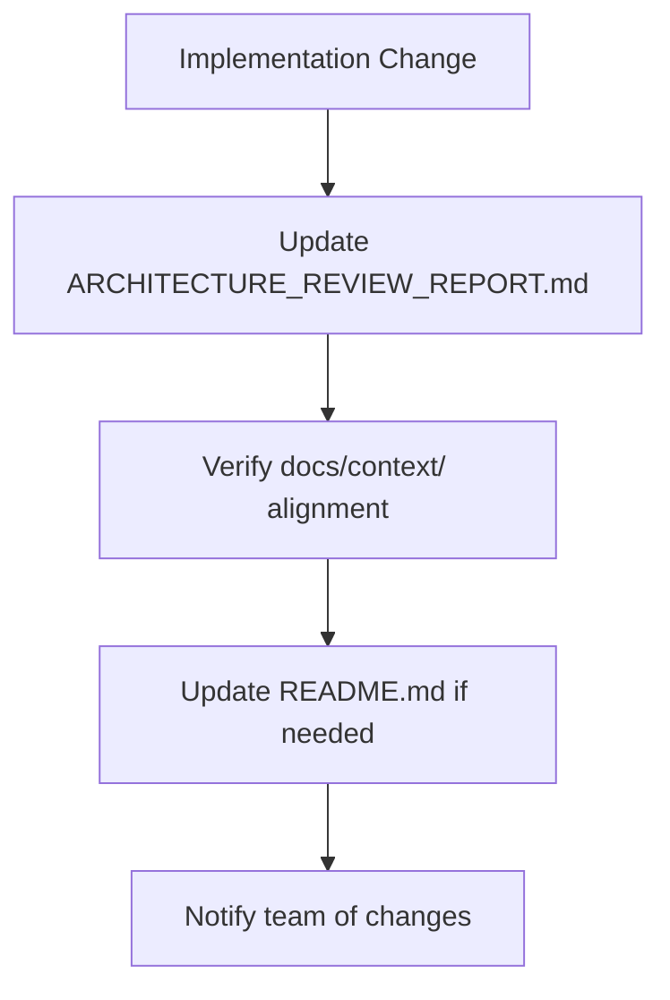

# 📚 HealthIQ AI v5 - Documentation Hierarchy & Source of Truth

## 🎯 **Documentation Authority Levels**

### **LEVEL 1: PRIMARY SSOT** (Always Check First)
- **`docs/ARCHITECTURE_REVIEW_REPORT.md`** - **CURRENT SPRINT STATUS & IMPLEMENTATION STATE**
  - **Purpose**: Authoritative source for current build/sprint status
  - **Contains**: What's implemented vs scaffolded vs missing, current sprint objectives, Definition of Done, critical gaps and next steps
  - **When to Use**: Before any code changes, sprint planning, status checks

### **LEVEL 2: CANONICAL SPECIFICATIONS** (Reference for Implementation)
- **`docs/context/PROJECT_STRUCTURE.md`** - **WHERE TO PUT FILES**
  - **Purpose**: Canonical folder structure and file layout
- **`docs/context/INTELLIGENCE_LIFECYCLE.md`** - **DATA FLOW & PIPELINE STAGES**
  - **Purpose**: Full end-to-end data and intelligence flow
- **`docs/context/STACK_BACKEND.md`, `STACK_TOOLS.md`** - **TECHNOLOGY DECISIONS**
  - **Purpose**: Backend tech stack, constraints, and orchestration principles
- **`docs/context/WORKFLOW_RULE.md`** - **OPERATIONAL BOUNDARIES**
  - **Purpose**: Execution routing and AI decision-making rules
- **`ssot/biomarkers.yaml`** - **CANONICAL BIOMARKER DATA**
  - **Purpose**: Canonical biomarker IDs, aliases, and SSOT guardrails

### **LEVEL 3: SUPPORTING CONTEXT** (Additional Reference)
- **`docs/context/PRD.md`** - **PRODUCT REQUIREMENTS**
  - **Purpose**: Product requirements and feature specifications
- **`docs/context/IMPLEMENTATION_PLAN.md`** - **DEVELOPMENT PHASES**
  - **Purpose**: Development phases and sprint planning
- **`docs/prp_*.md`** - **PRP TEMPLATES**
  - **Purpose**: PRP templates for agent-driven development

### **LEVEL 4: DEPRECATED** (Do NOT Use)
- ❌ **`docs/synthesized technical architecture for HealthIQ-AI v5.pdf`**
- ❌ **`docs/synthesized technical architecture for HealthIQ-AI v5.docx`**

---

## 🎯 **Navigation Workflow**

### **For Cursor Agents & Developers**

1. **BEFORE ANY CODE CHANGE**: Read `ARCHITECTURE_REVIEW_REPORT.md` for current status
2. **FOR IMPLEMENTATION GUIDANCE**: Consult `docs/context/` specifications
3. **FOR OPERATIONAL RULES**: Follow `WORKFLOW_RULE.md` boundaries
4. **WHEN IN DOUBT**: Check this document (`DOCUMENTATION_HIERARCHY.md`) for navigation

### **Sprint Planning & Architecture Decisions**
**USE**: `docs/ARCHITECTURE_REVIEW_REPORT.md` (Level 1)
- Current implementation status
- What's scaffolded vs. implemented vs. missing
- Current sprint objectives and Definition of Done
- Critical gaps and next steps

### **Technical Specifications**
**USE**: `docs/context/` files (Level 2)
- `PROJECT_STRUCTURE.md` - Where to put files
- `STACK_*.md` - Technology choices and constraints
- `INTELLIGENCE_LIFECYCLE.md` - Data flow and pipeline stages
- `WORKFLOW_RULE.md` - Operational boundaries

### **Supporting Context**
**USE**: `docs/context/` files (Level 3)
- `PRD.md` - Product requirements and feature specifications
- `IMPLEMENTATION_PLAN.md` - Development phases and sprint planning
- `prp_*.md` - PRP templates for agent-driven development

### **Implementation Reality Check**
**USE**: Actual codebase
- `backend/` - Current backend structure
- `frontend/` - Current frontend structure
- `ops/` - Current infrastructure setup

---

## 🚨 **Critical Rules**

### **DO NOT:**
- ❌ Use synthesized architecture documents for planning
- ❌ Build components that are already scaffolded
- ❌ Reference outdated implementation status
- ❌ Ignore existing scaffolded files

### **DO:**
- ✅ Check `ARCHITECTURE_REVIEW_REPORT.md` for current status
- ✅ Verify actual codebase before building new components
- ✅ Implement logic in existing scaffolded files
- ✅ Follow `docs/context/` specifications for new work

---

## 📅 **Documentation Maintenance**

### **When to Update:**
- After major implementation milestones
- When scaffolding new components
- When changing architecture decisions
- When completing development phases

### **Update Priority:**
1. **HIGH**: `ARCHITECTURE_REVIEW_REPORT.md` - Implementation status
2. **MEDIUM**: `docs/context/` files - Specifications and constraints
3. **LOW**: Reference documentation - Context and examples

---

## 🔄 **Documentation Workflow**

---

**This hierarchy ensures all development teams use accurate, current documentation for architectural decisions and sprint planning.**
