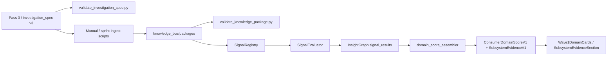
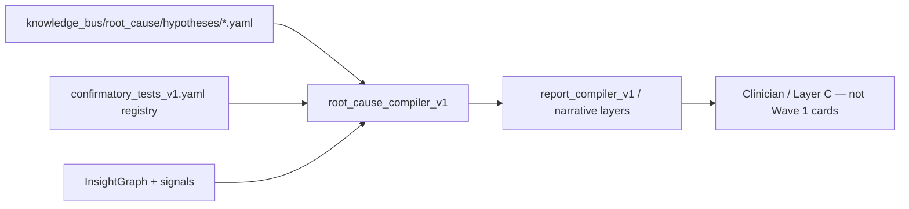
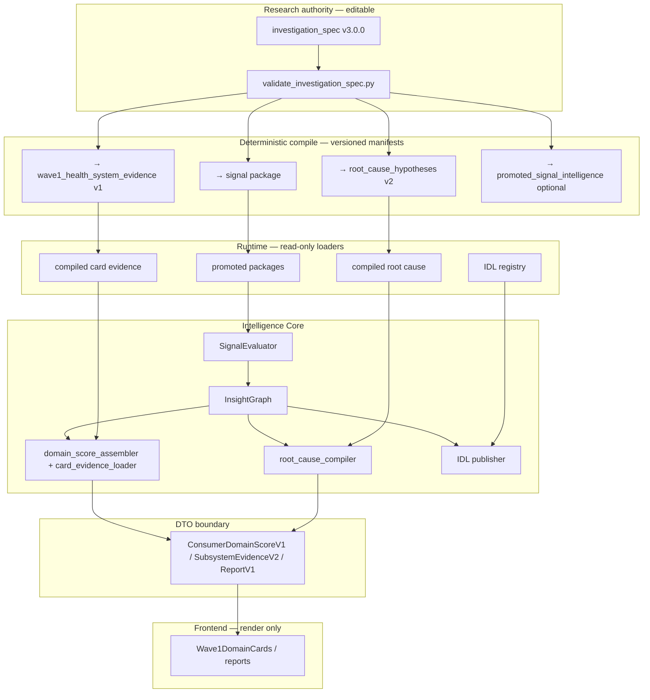

# ARCH-R1 — Research Asset to Runtime Intelligence Architecture Review

**Date:** 2026-05-28  
**Author:** Cursor (architecture review only — no implementation)  
**Status:** Recommendation for human governance approval  
**Inputs:** Pass 3 utilisation audits (Cursor + Claude), Wave 1 subsystem/role investigations, medical review, `User Health to Systems Map_FINAL.md`, Knowledge Bus SOP v1.3, Automation Bus SOP v1.3.1

---

## 1. Executive verdict

**The correct long-term architecture is not “make package files bigger” and not “read Pass 3 at runtime.”**

It is:

> **`investigation_spec` v3.0.0 (Pass 3 corpus) as the single canonical research authority → deterministic compile pipeline → multiple immutable governed runtime artifacts → thin runtime loaders → presentation-safe DTOs → frontend render-only.**

Concretely:

| Layer | Authority |
|---|---|
| **Research (editable)** | Validated `investigation_spec` v3 JSON/YAML under `knowledge_bus/research/` (Pass 3 batches are the current bulk corpus; future research uses the same contract) |
| **Signal firing (runtime)** | Promoted **packages** (`signal_library` + `research_brief` + manifest) — **compiled views**, not hand-maintained parallel truth |
| **Hypothesis / WHY (runtime)** | **Compiled** `root_cause` hypothesis assets from the same research source — **not** a divergent hand-authored fork |
| **Health Systems Card evidence (runtime)** | **New compiled artifact** (`wave1_health_system_evidence` or equivalent) mapping domain/subsystem → marker roles, rationales, policies — **not** hard-coded Python lists |
| **Retail prose safety** | **IDL** + consumer-prose sanitisers — gates *how* intelligence is shown, not *what* the medical graph is |
| **Frontend** | Renders DTO fields only; never authors medical semantics |

**Packages remain essential** but must shrink in *conceptual* scope: they are the **signal-activation compile target**, not the entire medical intelligence warehouse. Trying to stuff hypotheses, card evidence, and relationship graphs into `signal_library.yaml` alone will recreate lossy translation and duplicate authorities.

**Blunt assessment of today:** HealthIQ has **excellent upstream research** and **mediocre downstream plumbing**. The product looks thin because the architecture **stops intelligence at the signal evaluator** and **re-invents subsystem semantics manually**, while a **second hypothesis authority** drifts beside Pass 3.

---

## 2. Current-state map

### 2.1 Primary pipeline (intended)

### 2.2 Parallel pipeline (root-cause)

### 2.3 What actually happens to intelligence

| Stage | What survives | What dies |
|---|---|---|
| Pass 3 → pkg (2.0.0 ingest) | Activation, overrides, structured `supporting_metrics` (role, rationale), `explanation` from `narrative`, `research_brief` citations | `hypotheses`, contradictions, hypothesis ranking, `relationship_kind`, per-hypothesis missing-data policy, Pass 3 confirmatory tests |
| Pass 3 → pkg (legacy 1.0.0) | Activation, flat supporting id lists, some `explanation` | Roles, rationales, most structure |
| pkg → evaluator | Firing + confidence from flat supporting ids + overrides | `supporting_metrics[].role/rationale`, all of `explanation` (loaded but unused downstream) |
| Manual `wave1_subsystem_evidence.py` | Marker id presence/absence | All Pass 3 / pkg semantics; `evidence_role` always null |
| root_cause YAML | Report/narrative hypotheses for ~40 signals | Health Systems Cards; alignment with Pass 3 not enforced |

**Corpus note:** Pass 3 utilisation audits disagree on batch count (5 vs 9 files) because tranches were ingested incrementally. The repo currently holds **nine** `*_Pass_3.json` files and **153** v3.0.0 specs (Cursor inventory). Treat **the validated v3 contract + full Pass 3 corpus** as the research baseline, not “Batch_3–7 only.”

---

## 3. Current fragmentation problems

1. **Research richness is authored once, then amputated at compile** — seven of fourteen Pass 3 field groups do not reach packages (per PASS3 audits); cards never see the rest.

2. **Three subsystem authorities** — (a) manual `WAVE1_DOMAIN_SUBSYSTEM_DEFS`, (b) scoring-rail biomarker lists in `domain_score_assembler.py`, (c) package signal graphs. They are **not joined**.

3. **Two hypothesis authorities** — Pass 3 `hypotheses[]` vs `root_cause/hypotheses/*_v1.yaml`. No compile-through; silent divergence risk.

4. **`signal_id` collision** — Multiple Pass 3 specs share one `signal_id` (e.g. `signal_alt_high`, `signal_homocysteine_high`, `signal_hba1c_pct_high`). `SignalRegistry` keeps **lexicographically last** package — product loses alternate medical frames without trace.

5. **CRP exemplar failure** — Rich Batch 4 Pass 3 CRP specs exist; runtime `signal_crp_high` still comes from **legacy** `pkg_s24_crp_high_inflammation` (pre–Pass 3). Research investment is **bypassed**.

6. **`explanation` orphan** — Present on `SignalResult`, absent from report top findings and cards. Intelligence is **computed-adjacent but product-invisible**.

7. **`promoted_signal_intelligence.yaml`** — Holds `relationship_kind` for a KB47 subset; **no production loader**. A third partial package shape.

8. **IDL vs Pass 3 narrative** — IDL gives retail-safe phenotype copy; Pass 3 gives mechanism/pathway/implications. Both are valid but **uncoordinated** on cards (IDL drives headlines; subsystem section ignores both).

9. **Medical review vs implementation** — Medical review says several v1 subsystems are **too thin to score visibly** (CRP-only vascular, homocysteine-only pathway, split liver). Code still renders them as peer subsystems.

10. **Equivalence debt** — `bilirubin` / `total_bilirubin` false-missing undermines trust in any “missing marker” UX fed by manual maps.

---

## 4. Source-of-truth assessment

| Asset | Current role | Strength | Weakness | Should be authority for what? |
|---|---|---|---|---|
| **Pass 3 / `investigation_spec` v3.0.0** | Research output corpus; partial ingest source | Complete hypothesis graph, roles, `relationship_kind`, contradictions, missing-data policy, confirmatory tests, narrative | Not validated at package promotion; not runtime-safe if read directly; batch/file fragmentation | **Canonical medical research graph** (authoring + audit). **Not** runtime. |
| **Package `signal_library` + `research_brief`** | Runtime signal firing via `SignalRegistry` | Immutable, validator-gated, deterministic activation; 2.0.0 preserves roles in YAML | Lossy vs Pass 3; duplicate `signal_id`; legacy 1.0.0 mix; wrong scope if forced to hold all intelligence | **Runtime authority for signal activation & escalation only** |
| **`root_cause/hypotheses/*.yaml`** | `root_cause_compiler_v1` → reports | Operational today; rule-based evidence_for/against | Hand-authored; overlaps Pass 3; no card surfacing; drift | **Compiled runtime view of hypotheses** — source must become Pass 3, not parallel authoring |
| **`confirmatory_tests_v1.yaml` registry** | Stable test ids for root-cause compiler | Governed id indirection | Not linked to Pass 3 `test_id` compile mapping | **Registry authority for test identity**; Pass 3 supplies mappings at compile time |
| **IDL (`idl_records_v1.yaml`)** | Phenotype retail copy, severity from fired signals | Safety-separated consumer labels | Not marker-level; not subsystem evidence | **Presentation / phenotype copy authority** — not marker roles or hypotheses |
| **`wave1_subsystem_evidence.py` maps** | Card subsystem chips | Simple, deterministic | Manual; disconnected from research; medically thin | **Must be demoted** — replaced by compiled card-evidence artifact |
| **`SubsystemEvidenceV1` DTO** | API contract for subsystems | `evidence_role` hook exists | Fields mostly empty; no rationale/hypothesis slots | **Transport contract** — populated from compiled artifacts only |
| **`SignalResult.explanation`** | Serialized in insight graph | Already in pipeline | No consumer | **Intermediate** — either wire to compile artifact or stop duplicating |
| **Frontend display helpers** | Fallback labels | Resilience | Must not become semantic authority | **Never** authority |

---

## 5. Architecture options

| Option | Description | Pros | Cons | Risk | Long-term fit | Recommendation |
|---|---|---|---|---|---|---|
| **A. Enrich packages until they are the full runtime authority** | Add hypotheses, contradictions, `relationship_kind`, card maps into `signal_library` / new pkg files | Single loader path; aligns with immutable package culture | Bloated packages; signal firing coupled to UX; duplicate `signal_id` worse; violates separation in User Health → Systems Map | High | Poor | **Reject** as sole strategy |
| **B. Pass 3 canonical → compile multiple governed runtime views** | One research contract; compile to signal pkg, root_cause, card evidence, optional PSI | Preserves richness; clear provenance; validators per artifact; matches SOP “validators decide” | Requires build pipeline investment; migration of 40 RC YAML files | Medium | **Excellent** | **Recommended** |
| **C. Separate Health Systems Card evidence layer beside packages** | New YAML/JSON only for cards, manually curated | Fast for Wave 1 | **Third authority** unless compiled from Pass 3; bolt-on | High | Poor alone | **Only** as compiled output of B |
| **D. Merge root-cause hypotheses into package files** | One file per package with everything | Fewer directories | Massive files; mixes firing with WHY; hard to validate | High | Poor | **Reject** |
| **E. Keep architecture; patch gaps incrementally** | Fill `evidence_role`, wire explanation, tweak maps | Short-term demos | Entrenches triple authority; Pass 3 still lossy; medical debt remains | Medium–High | Poor | **Reject** as end state; tolerable **only** as Phase 0 bridge behind B |
| **F. Unified Research Source Model (RSM)** | Formal `research_spec_id` per investigation frame; `signal_id` becomes non-unique; compile emits `activation_key` + views | Fixes collision; explicit multi-frame medicine | Larger contract change | Medium | Excellent | **Adopt** as part of B (spec identity ≠ signal identity) |

---

## 6. Recommended target architecture

### 6.1 Pipeline (target state)

### 6.2 Layer responsibilities

| Layer | Responsibility |
|---|---|
| **Research source** | Full medical graph: markers, roles, `relationship_kind`, hypotheses, contradictions, policies, tests, narrative, citations |
| **Validation** | `validate_investigation_spec.py` (research); per-artifact validators on compile outputs; `validate_knowledge_package.py` unchanged in authority |
| **Signal package compile** | Activation, overrides, dependencies, flat supporting ids for confidence, `research_brief` sources |
| **Root-cause compile** | Map Pass 3 `hypotheses[]` + `confirmatory_tests[]` → governed YAML matching compiler expectations (rules derived or templated, not re-authored) |
| **Card evidence compile** | Map research + `User Health to Systems Map` rules → per-domain subsystem definitions with **card marker roles** (`score_contributor`, `confidence_contributor`, `contextual`, `missing_for_confidence`), short rationales, optional subsystem summary from `supporting_marker_roles` / `interpretation` |
| **IDL / presentation** | Retail-safe phenotype headlines; severity; forbid diagnostic language |
| **DTO** | Stable API shapes; versioned (`card_schema_version`, `subsystem_evidence_schema_version`) |
| **Frontend** | Layout, expand/collapse, formatting — **no** medical inference |

### 6.3 Card marker role translation (governed)

Package/signal roles (`corroborator`, `mechanism_marker`, …) **≠** card roles. A **published translation table** (governed YAML) maps:

`(package_role, relationship_kind, domain_id, subsystem_id, primary|supporting)` → `card_marker_role`

This implements the finding from `WAVE1_existing_pkg_biomarker_role_authority_investigation.md` (translation layer required) **without** making the frontend or manual Python the authority.

### 6.4 Fired-signal binding

At runtime, card evidence rows are **selected** using:

- panel presence + rail scores (today)
- **plus** optional binding to `active_signal_ids` / `spec_id` provenance when a package frame fires

Subsystem copy for CRP should come from **residual cardiometabolic** vs **acute inflammatory** frames, not from whichever `signal_crp_high` package wins lexicographic sort.

---

## 7. Package-file decision

**Packages should be expanded only within signal scope**, then frozen as **compiled outputs**:

| Keep in package | Move out to compiled artifacts |
|---|---|
| `activation_logic`, `activation_config`, `thresholds` | `hypotheses[]`, `contradiction_markers[]` |
| `override_rules` + `source_refs` | `hypothesis_ranking` |
| `primary_metric`, `trigger_direction`, `dependencies` | Domain/subsystem grouping |
| `supporting_metrics` ids + roles for **validator fidelity** (optional read for future confidence v2) | Card-specific role translation |
| `research_brief` citations | Full per-marker display rationales (may compile subset into card artifact) |
| `output.supporting_markers` flat list | `missing_data.policy` prose for UX |

**Add to `signal_library` schema (2.1.0):** `relationship_kind` on `supporting_metrics[]` and **`source_spec_id`** / `research_spec_id` on each signal — **not** as a second truth, but as compile provenance and disambiguation.

**Do not** treat current packages as already-complete authorities — ~44 remain schema 1.0.0; CRP shows **stale lineage**.

---

## 8. Pass 3 decision

| Question | Decision |
|---|---|
| Runtime read? | **No** — violates immutability, remap contracts (KB-S52B), and validator boundary |
| Canonical research? | **Yes** — as the present body of v3.0.0 specs; future research uses same contract |
| Recompile into packages? | **Yes** — all promoted packages must declare `source_spec_id` → investigation spec |
| Multiple downstream compiles? | **Yes** — signal pkg + root cause + card evidence (+ optional PSI full fidelity) |
| Deprecate Pass 3? | **No** — archive after compile only if superseded by tagged spec versions in git (research history) |

Pass 3 batch JSON files may eventually fold into per-spec YAML under `investigation_specs/`, but **the contract remains**, not the file shape.

---

## 9. Root-cause hypothesis decision

| Question | Decision |
|---|---|
| Duplicates Pass 3? | **Conceptually yes** for covered signals; **operationally** they are independently authored today |
| Future | **Compiled view** from Pass 3 `hypotheses[]`, with `evidence_for_rules` / `evidence_against_rules` generated deterministically from `supporting_marker_refs`, `contradiction_markers`, and lab-range policies |
| Remain separate hand YAML? | **No** as authority — retain only as **legacy** until compile parity; then read-only archive |
| Conflicts with Pass 3? | **Yes, risk today** — e.g. homocysteine B12 frame in Pass 3 vs `hcy_hypotheses_v1.yaml` rule ids; no CI diff |
| Governance | Compile manifest must list `source_spec_id` per hypothesis; CI fails if Pass 3 changes without recompile |

**Report/narrative** continues to consume root-cause compiler output; **cards** consume **card evidence compile**, which may **reference** top hypothesis summary fields but must not fork a third prose source.

---

## 10. Health Systems Card evidence decision

Cards should consume a **dedicated compiled artifact** (working name: `knowledge_bus/compiled/wave1_health_system_evidence_v1.yaml`), not raw packages and not manual Python dicts.

### 10.1 Field sourcing

| UX need | Source in compile input | In card artifact |
|---|---|---|
| Marker role (user-facing) | Pass 3 `role` + `relationship_kind` + medical review rules | `card_marker_role` enum |
| Rationale (short) | Pass 3 `supporting_markers[].rationale` | `rationale_short` (length-capped, sanitised) |
| Missing-data policy | Pass 3 `hypotheses[].missing_data.policy` + subsystem context | `missing_policy_line` when marker missing |
| Hypothesis framing (retail) | Pass 3 ranked `physiological_claim` + IDL tone rules | `leading_frame_line` / `alternate_frame_line` (optional expand) |
| Contradiction markers | Pass 3 `contradiction_markers[]` | `caveat_lines[]` — **not** diagnoses |
| Confirmatory tests | Pass 3 `confirmatory_tests[]` mapped to registry ids | `suggested_follow_up_tests[]` on expand |
| Pathway / mechanism | Pass 3 `narrative` or signal `explanation` | `subsystem_summary` + `mechanism_line` on expand |

### 10.2 What cards should not do

- Show full hypothesis lattice by default (medical review: avoid over-specificity).
- Treat all subsystems as scored equals when medical review says **context-only**.
- Use IDL alone for marker-level semantics.

### 10.3 Alignment with medical review

Implement **visibility tiers** in compile artifact:

- `visibility: scored_subsystem | contextual_evidence | hidden_v1`

So CRP / homocysteine / split liver can be governed down without deleting research.

---

## 11. Governance and validation implications

| Control | Requirement |
|---|---|
| **Research validator** | `validate_investigation_spec.py` on every spec change (already in KB SOP §9) |
| **Compile manifest** | `compile_manifest.yaml` with input spec hashes → output artifact hashes |
| **Package validator** | `validate_knowledge_package.py` remains promotion gate; add `source_spec_id` required |
| **Signal library schema** | Bump to 2.1.0: `relationship_kind`, `research_spec_id`; forbid duplicate `(package_id, signal_id)` not duplicate research frames |
| **Card evidence schema** | New `wave1_health_system_evidence_schema_v1.yaml` |
| **Root-cause schema** | v2 aligned to Pass 3 hypothesis objects; validator on compile output |
| **Compile CI** | Fail if Pass 3 hash changes but compile outputs unchanged |
| **Sentinel guards** | Extend regression sentinels: `health_system_subsystems_not_from_research_compile`, `pass3_hypothesis_drift_vs_root_cause`, `signal_id_collision_unresolved` |
| **Automation Bus** | Next implementation WP = **HIGH**, `change_type: MIXED`, Intelligence Core touch — full SOP |
| **Medical sign-off** | Card artifact changes with visibility tiers require clinical review record per package tranche |

**Do not** wire `validate_investigation_spec` into `validate_knowledge_package` without a compile step in between — validators gate **different layers**.

---

## 12. Migration plan

### Phase 0 — Immediate safety (bridge, not architecture)

**Goal:** Stop trust erosion without new authorities.

- Governed equivalence for `bilirubin` / `total_bilirubin` in subsystem partition.
- Rename weak subsystems per medical review (copy-only where possible).
- Document `signal_id` collision manifest (inventory only).

*Does not replace ARCH-R1 target.*

### Phase 1 — Compile foundation (short-term)

- Introduce `research_spec_id` on investigation specs (may equal `spec_id` today).
- Build **deterministic compiler v1**: `investigation_spec` → `signal_library` slice (prove parity with one KB-S52D package).
- Add CI: compile diff + `source_spec_id` in manifest.

### Phase 2 — Dual-compile (medium-term)

- Compile **root_cause** v2 for Wave 1–relevant signals from Pass 3; run diff against existing `*_hypotheses_v1.yaml`; human adjudicate deltas.
- Compile **wave1_health_system_evidence_v1** for three domains; replace `WAVE1_DOMAIN_SUBSYSTEM_DEFS` reads with loader.
- Extend `SubsystemEvidenceV1` → v2 fields (`card_marker_role`, `rationale_short`, `visibility_tier`).

### Phase 3 — Runtime integration (medium-term)

- `domain_score_assembler` loads card evidence artifact; populates `evidence_role`.
- Optional: surface `subsystem_summary` on expand; route confirmatory tests to existing next-step machinery.
- Re-ingest CRP from Pass 3; retire or demote legacy `pkg_s24_crp_high_inflammation` for active package pointer.

### Phase 4 — Long-term pipeline (steady state)

- All new research → v3 spec only → compile all views → promote.
- Deprecate hand-authored root-cause YAML (archive).
- PSI loader wired **or** PSI merged into compile as optional full-fidelity export.
- Behavioural validators (KB SOP §10 roadmap): threshold overlap, contradictory frames.

---

## 13. Risks and trade-offs

| Risk | Mitigation |
|---|---|
| **Migration cost** (~153 specs, 186 packages, 40 RC files) | Phased compile; parity tests per signal; do not big-bang |
| **Complexity** | Multiple artifacts, but **one research authority** — simpler than today’s silent triple fork |
| **Medical overclaim** | Visibility tiers + IDL safety + collapsed default UI |
| **Duplicate signal_id** | `research_spec_id` as package key; evaluator registry keyed by `activation_key` or `(signal_id, spec_id)` |
| **Team habit (“just edit pkg”)** | SOP amendment: packages are compile outputs; edits require spec change or explicit compile override ticket |
| **Product impatience** | Phase 0 bridge shows progress without cementing wrong architecture |

**Product benefit if done:** Health Systems Cards become **research-backed explainability** with provenance, not chip lists — the deterministic moat the strategy doc promises.

---

## 14. Recommended next work package

**Do not implement in ARCH-R1.** Proposed first governed sprint **after** human approval of this architecture:

| Field | Value |
|---|---|
| **work_id** | `KB-COMPILER-1_investigation_spec_v3_compile_foundation` |
| **risk level** | **HIGH** (`change_type: MIXED`) — touches `knowledge_bus/`, compile tooling, possibly `SignalRegistry` contract |
| **objective** | Deliver deterministic `investigation_spec` v3 → `signal_package` compiler + `source_spec_id` provenance + CI parity test for one tranche (e.g. HbA1c / homocysteine / ALT triple-frame family); **no** card UI change in same WP |
| **files likely touched** | `knowledge_bus/tools/` or `backend/scripts/` (new compiler), `knowledge_bus/schema/`, `investigation_spec_schema_v3.0.0.yaml` (provenance fields), `validate_knowledge_package.py` / manifest schema, tests under `backend/tests/unit/`, docs in `docs/governance/` (compile SOP addendum) |
| **what must not change** | Scoring rails, cluster engines, frontend components, IDL copy, user-visible card behaviour until `WAVE1-CARD-EVIDENCE-1` follow-on |

**Follow-on WP (second):** `WAVE1-CARD-EVIDENCE-1_compile_and_wire_health_system_subsystems` — card artifact + loader + DTO v2 + subsystem UI.

---

## 15. STOP conditions

Until architecture is **explicitly approved**, do **not**:

1. **Load `*_Pass_3.json` (or any investigation spec) in the orchestrator / API hot path.**
2. **Let frontend or `wave1_subsystem_evidence.py` invent roles, rationales, or mechanism text.**
3. **Expand manual subsystem maps as the long-term solution** (equivalence fixes are OK in Phase 0).
4. **Add another ad-hoc YAML under `knowledge_bus/` without schema, validator, compile manifest, and SOP entry** (no fourth authority).
5. **Copy Pass 3 prose into retail UI without IDL / consumer-prose safety pipeline.**
6. **Merge root-cause hypotheses into `signal_library.yaml` blobs.**
7. **Promote new Pass 3-derived packages without resolving `signal_id` collisions.**
8. **Assume `explanation` on `SignalResult` is sufficient** — wiring orphan fields without compile provenance perpetuates drift.
9. **Treat `promoted_signal_intelligence` as production authority without loader + promotion gate.**
10. **Ship card hypothesis/contradiction UI before visibility tiers and medical review alignment.**

---

## Appendix — Duplicate authority checklist

| Risk | Status today | Target |
|---|---|---|
| Pass 3 vs packages | Lossy ingest; CRP bypass | Single compile from spec |
| Packages vs root-cause | Parallel authorship | RC compiled from spec |
| Package roles vs card roles | Unconnected | Translation table on card compile |
| IDL vs Pass 3 narrative | Both used; different surfaces | IDL = phenotype retail; card artifact = marker/subsystem |
| Manual subsystem map vs research | Manual wins | Compile wins |
| Frontend labels vs backend | Fallback humanize | Backend supplies display fields |
| `signal_id` vs `spec_id` | Collision | `research_spec_id` everywhere |

---

*End of ARCH-R1 review.*
