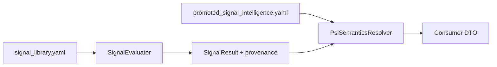

# PSI Runtime Wiring Design (Design Only)

**Work package:** ARCH-RT-1  
**Status:** DESIGN ONLY — **no implementation in ARCH-RT-1**

## Scope boundary

This document describes a **future** integration. ARCH-RT-1 explicitly forbids:

- Modifying `SignalRegistry`, `SignalEvaluator`, `SignalResult`, orchestrator  
- Loading PSI in any runtime path  
- Frontend PSI parsing or inference  
- Expanding PSI schema to include hypotheses

## Proposed load point

```text
orchestrator.py
  → SignalEvaluator.evaluate()  # unchanged firing
  → NEW: PsiSemanticsResolver.attach(signal_results, activation_keys)
  → InsightGraph / report / DTO assembly
```

**Package-scoped vs estate-indexed:** Prefer **estate index** (`compile_estate_index.yaml`) mapping `activation_key` → PSI file path, with package directory as physical storage.

## Join keys (priority order)

| Key | Use |
|-----|-----|
| `activation_key` | Primary join (`signal_id::spec_id`) |
| `source_spec_id` | Manifest / PSI `investigation_spec_id` validation |
| `signal_id` | Family-level rollups only — insufficient alone |
| `package_id` | Storage provenance; debugging |

## Data flow (future)



## Future owning sprint

| Sprint | Work |
|--------|------|
| **ARCH-RT-2** | `activation_key` on `SignalResult`; registry identity pilot |
| **ARCH-RT-5** (or dedicated PSI sprint in FINAL plan) | PSI runtime wiring + DTO fields |
| **ARCH-RT-3** | Estate regeneration ensures PSI coverage policy |

Exact sprint id to be confirmed when ARCH-RT-2 scope is locked; wiring **after** identity pilot.

## Must not happen

1. Raw investigation spec reads at runtime.  
2. PSI containing hypothesis graphs or card evidence.  
3. Frontend loading `promoted_signal_intelligence.yaml` directly.  
4. PSI driving activation thresholds (firing stays in `signal_library.yaml`).  
5. Silent fallback when PSI missing — explicit `semantics_available: false` on DTO.

## References

- `docs/architecture/psi_gap_closure_mechanics.md`  
- `docs/architecture/ADR-RT-002_signal_spec_identity_and_registry_policy.md`
