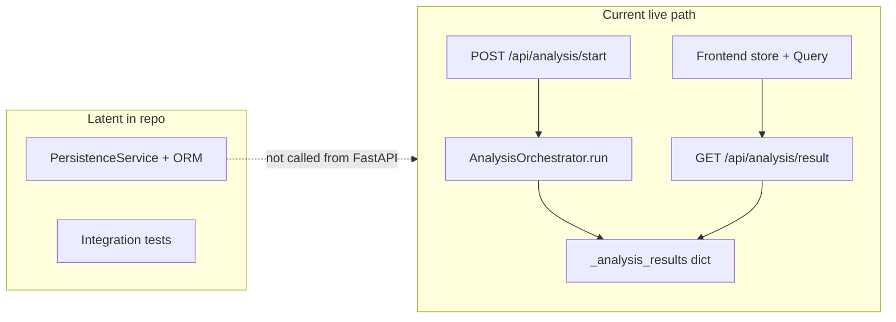

# FE-PERSISTENCE Preflight — Analysis Persistence and Continuity Foundation

**Work ID:** FE-PERSISTENCE-PREFLIGHT  
**Execution model:** READ_ONLY investigation (this document only)  
**Basis:** repo inspection as of authoring; primary sources cited inline.

---

## 1. Executive summary

### Current persistence maturity

- **Live product path (HTTP `/api/analysis`) is intentionally transient:** completed analyses are held in an in-memory dict; the app prints “fixture-only mode (no database required)” on startup.
- **A substantial SQLAlchemy domain model and a `PersistenceService` already exist** (profiles, analyses, analysis results, related rows, audit logs), with **integration tests** against mocked DB sessions. This layer is **not registered or invoked** from FastAPI routes today.
- **Frontend continuity is mostly client-only:** Zustand keeps a rolling in-memory `analysisHistory`; TanStack Query fetches `/api/analysis/result` by id and syncs into the store. There is **no** working server-backed history wired to the UI.
- **Auth exists for identity (Supabase JWT)** on `/api/auth/*` and optional Bearer verification via `get_gotrue_user`, but **analysis routes do not use it**, and **`AnalysisService` does not send `Authorization`** on analysis calls (unlike the disabled `ReportsService` pattern).

### Key gaps

1. **No operational DB in the running API:** `backend/config/database.py` and `app/main.py` startup messaging assume fixture-only operation; no Alembic (or similar) migrations were found in-repo at preflight time.
2. **Endpoint drift:** Frontend `AnalysisService.getAnalysisHistory` and `exportAnalysis` target **`/api/analysis/history`** and **`/api/analysis/export`**, which **do not exist** on `app/routes/analysis.py` (only `start`, `result`, `events`, `fixture`).
3. **Dual “history” implementations:** `frontend/app/services/history.ts` is an explicit **mock** with TODOs; `useHistory` imports that mock, while tests elsewhere target `AnalysisService.getAnalysisHistory`—a **split brain** for future wiring.
4. **ID and DTO parity:** Live analysis IDs may be **ULID strings** when `ulid` is installed, while ORM `Analysis.id` is **UUID**. Persisting without a defined ID strategy will fail or require migration. **`PersistenceService.get_analysis_result`** returns a dict that **does not** go through `build_analysis_result_dto`; the live path compiles **`clinician_report_v1`** from in-memory `meta.insight_graph.report_v1`. A DB round-trip must define whether **full meta / report payload** is stored or **recomputed** on read.
5. **RLS / ownership:** No in-repo Postgres RLS policies were found; `Profile.user_id` is documented as linking to auth users, but **per-user isolation** would be application-layer (or future Supabase policies), not evidenced in HTTP handlers today.

### First practical unlock

**Make one analysis path durable and retrievable for an authenticated user:** operational database session for the API, persist the same payload the frontend already consumes (or a defined projection), and expose **scoped** list + get-by-id that the frontend can call with the same JWT used for `/api/auth/me`—without requiring FE-PAGES polish.

---

## 2. FE-PERSISTENCE definition (from strategy)

**Source:** `docs/HealthIQ_AI_Strategic-Vision-and-12-Month-Sprint-Plan_v1.5_FINAL_ADOPTED.md` (Wave 3, FE-PERSISTENCE).

| Strategic intent | What FE-PERSISTENCE should deliver |
|------------------|-------------------------------------|
| Persist user analyses/results | Durable storage tied to identity, not process memory |
| Minimum Phase 1 persistence model | Clear model for analysis + result (and what is deferred) |
| Dashboard/history continuity | Ability to resume/list history—not necessarily final UX |
| Future report retrieval & authenticated use | Foundation for later FE-PAGES; align with privacy/compliance |

### What belongs in FE-PERSISTENCE

- **Backend:** persistence model alignment with existing ORM (or deliberate replacement), save path from the real pipeline output, retrieval/list endpoints, **ownership** enforcement at the application layer (and documented assumptions for Supabase/RLS).
- **Frontend:** stop relying solely on in-memory history for continuity; call real APIs; optionally unify `history.ts` vs `AnalysisService.getAnalysisHistory`; attach **Bearer** (or agreed mechanism) where routes are protected.
- **Contract:** explicit decision on **analysis id type**, and on **stored vs derived** fields for `clinician_report_v1` / `meta` so `/result` stays stable.

### What should remain for later (FE-PAGES / FE-ACCOUNT)

**FE-PAGES** (Wave 4): “implement the currently incomplete customer-facing product pages,” “make history, report retrieval, and detailed analysis genuinely usable,” “move the app beyond upload/results into a persistent product.” That is **UX and surface completion**, not the minimal persistence spine.

**FE-ACCOUNT** (Wave 4): “Profile, settings, and My Account management”—rich account management **beyond** “attach Supabase `user.id` to stored analyses.”

---

## 3. Current-state audit

### 3.1 Backend persistence

| Area | State | Evidence |
|------|--------|----------|
| Live analysis storage | **Transient (real)** | `backend/app/routes/analysis.py`: module-level `_analysis_results` dict; comments “replaces database persistence”; `start` stores dict; `result` reads it. |
| DB initialization in dev | **Absent / stub** | `backend/config/database.py`: non-prod prints fixture-only mode. |
| App startup | **Asserts no DB** | `backend/app/main.py` `startup_event`: “fixture-only mode (no database required)”. |
| ORM models | **Real (unused by routes)** | `backend/core/models/database.py`: `Profile`, `Analysis`, `AnalysisResult`, related tables, indexes, FK `Analysis.user_id` → `profiles.user_id`. |
| Persistence service | **Real (tested off HTTP)** | `backend/services/storage/persistence_service.py`: `save_analysis`, related saves, `get_analysis_history`, `get_analysis_result`; integration tests under `backend/tests/integration/`. |
| Migrations | **Not evidenced in-repo** | No `alembic/` tree found at preflight search. |
| HTTP wiring | **Absent** | `grep` of `app/routes/*.py` shows no `PersistenceService` usage; only analysis route references to persistence are comments. |
| Export API | **Absent on router** | `AnalysisService` POSTs to `/analysis/export`; no matching route in `analysis.py`. |
| History API | **Absent on router** | `AnalysisService` GETs `/analysis/history`; no matching route in `analysis.py`. |

### 3.2 Auth / user linkage

| Area | State | Evidence |
|------|--------|----------|
| Supabase auth HTTP | **Real** | `backend/app/routes/auth.py`: register/login, session payload, `/me` with `UserIdentity`. |
| Bearer verification | **Real (dependency)** | `backend/core/dependencies/auth.py`: `get_gotrue_user`, `CurrentUser`. |
| Analysis routes | **No auth** | `backend/app/routes/analysis.py` does not depend on `get_gotrue_user`. |
| Profile linkage model | **ORM ready, HTTP not wired** | `Profile.user_id` “Foreign key to auth.users”; analyses reference `profiles.user_id`. Creating/joining `Profile` rows for Supabase users is **bridging work** for FE-PERSISTENCE. |
| FE session | **Partial** | `frontend/middleware.ts` protects `/dashboard`, `/analysis`, etc. via `healthiq_access_token` cookie; **`/results` is not in the protected prefix list**. |
| FE analysis calls | **Unauthenticated** | `frontend/app/services/analysis.ts`: `fetch` without `Authorization` (contrast `reports.ts`, disabled). |

**FE-FOUNDATION sufficiency:** Identity **is** obtainable server-side for routes that adopt `get_gotrue_user`. It is **not** yet threaded into analysis or persistence. Cookie-based routing protection exists; **API-side ownership** does not.

### 3.3 Frontend continuity

| Area | State | Evidence |
|------|--------|----------|
| Result by ID | **Transient server + client cache** | `useAnalysisResult` → `AnalysisService.getAnalysisResult` → GET `/api/analysis/result`; syncs to Zustand + `addToHistory`. |
| In-app history | **In-memory only** | `analysisStore.ts`: `analysisHistory` array, `addToHistory` caps at 50; **no zustand `persist`**. |
| History hook / service | **Stub** | `frontend/app/services/history.ts`: mock empty list, TODO Sprint 9b; `useHistory` uses this file. |
| Alternate API client | **Dead end today** | `AnalysisService.getAnalysisHistory` calls missing backend route. |
| Dashboard | **Placeholder** | `frontend/app/(app)/dashboard/page.tsx`: stub copy only. |
| Results page | **Assumes URL or store** | `results/page.tsx`: `analysis_id` query param or `currentAnalysis`; redirects to `/upload` if nothing to show; **assumes live result fetch**, not long-term library. |

### 3.4 Orchestrator / longitudinal features

| Area | State | Evidence |
|------|--------|----------|
| DB session for orchestrator | **Not passed from HTTP** | `AnalysisOrchestrator()` in `analysis.py` with default `db_session=None`. |
| Snapshot linking | **Conditional on DB + user_id** | `orchestrator.py`: if `self.db_session is not None` and `user.get("user_id")`, calls `link_prior_snapshot_insight_graphs`; fixture/test modes soft-fail. |

So **engine support for longitudinal linking exists** but **cannot activate** without a DB session and stable user/analysis identity in the request path.

### 3.5 Transient vs persistent flow (summary)

---

## 4. Likely implementation surfaces

| Surface | Role |
|---------|------|
| `backend/app/main.py` | DB engine/session lifecycle; optional dependency overrides; router registration if new modules split. |
| `backend/config/database.py` | Replace stub with real configuration; env-specific behaviour. |
| `backend/app/routes/analysis.py` | Save after `orchestrator.run`; `GET /result` from DB **or** hybrid; add `history`, `export` **or** deprecate client calls. |
| New route module (optional) | Scoped `GET /me/analyses` pattern to keep auth boundaries clear. |
| `backend/core/dependencies/auth.py` | Reuse `get_current_user` on protected analysis endpoints. |
| `backend/services/storage/persistence_service.py` + `backend/repositories/*` | Align save payload with `_analysis_results` structure or DTO builder input; extend if JSON blobs needed for `meta` / clinician report. |
| `backend/core/dto/builders.py` | Single path for HTTP responses from DB rows vs memory (include `compile_clinician_report_v1` behaviour). |
| `backend/core/models/database.py` | Possible JSON columns or ID type alignment; snapshot tables if linking storage is required. |
| Migrations / Supabase DDL | Out-of-repo or new tooling—must be authored in sprint. |
| `frontend/app/services/analysis.ts` | `Authorization` header; possibly replace broken `history`/`export` URLs once backend exists. |
| `frontend/app/services/history.ts` + `frontend/app/hooks/useHistory.ts` | Unify with `AnalysisService` or backend contract; remove mock. |
| `frontend/app/state/analysisStore.ts` / `frontend/app/queries/analysisResult.ts` | Optional hydration from server history; persist middleware is a later enhancement. |
| Tests | `backend/tests/integration/test_persistence_service.py`; frontend service tests expecting `/analysis/history`; E2E `persistence-pipeline.spec.ts` mocks—update when API is real. |

---

## 5. Recommendation

### 5.1 First FE-PERSISTENCE workpackage shape

1. **Operational persistence:** DB URL, session factory, and startup behaviour that matches prod (even if dev uses local Postgres); define how schema is applied (migrations or Supabase SQL).
2. **Identity + ownership:** Resolve Supabase `user.id` → `profiles` row (create-on-first-use or explicit FE-ACCOUNT handoff—**decision point**); require Bearer on save/list/get where data is user-scoped.
3. **Save path:** After successful `orchestrator.run`, persist minimal Phase 1 record: analysis row + result blob or normalized child rows; fix **ULID vs UUID** strategy.
4. **Read path:** Implement `GET` result and list endpoints **consistent with** `build_analysis_result_dto` / frontend `AnalysisResult` (including `clinician_report_v1` policy).
5. **Frontend wiring:** Send JWT on analysis APIs; replace mock `history.ts` or delegate to `AnalysisService`; keep FE-PAGES out of scope except minimal continuity (e.g. dashboard stub may still be thin).

### 5.2 COMBINED vs SPLIT

**Recommendation: SPLIT** into a short ordered sequence.

| Phase | Focus | Rationale |
|-------|--------|-----------|
| **FE-PERSISTENCE-A** | DB plumbing + schema + save path + ID/DTO decisions + auth-scoped write | Unblocks durability without blocking on full history UX; de-risks ULID/UUID and meta storage. |
| **FE-PERSISTENCE-B** | List/history contract + GET-by-id from DB + frontend continuity (unify services, Bearer, optional redirect/protect `/results`) | Depends on A’s schema and identity mapping; delivers end-user continuity. |

A single combined sprint is possible for a very small team but **splits reduce integration risk** given the number of missing endpoints and the DTO/compiler gap.

---

## 6. Structural integrity check

| Dependency | Blocking? | Notes |
|------------|-----------|-------|
| **FE-PAGES** | **No** for foundation | Full “usable history pages” is Wave 4; persistence can ship with minimal API + thin UI. |
| **FE-ACCOUNT** | **Partial** | Rich profile/settings not required; **minimal Profile row / user mapping** may be required for FK integrity on `Analysis.user_id`. |
| **Major backend redesign** | **No** | Incremental wiring of existing `PersistenceService` / ORM is the natural path. |
| **Major contract redesign** | **Bounded** | Must align DB-stored shape with `build_analysis_result_dto` / clinician compile—**significant but local** to persistence + DTO layer. |
| **Unrelated engine changes** | **No** | Orchestrator already supports optional DB for snapshot linking once session + user_id exist. |

---

## 7. Source index (non-exhaustive)

- Strategy: `docs/HealthIQ_AI_Strategic-Vision-and-12-Month-Sprint-Plan_v1.5_FINAL_ADOPTED.md` (Wave 3 FE-PERSISTENCE; Wave 4 FE-PAGES / FE-ACCOUNT).
- Live routes: `backend/app/routes/analysis.py`, `backend/app/main.py`.
- ORM: `backend/core/models/database.py`.
- Persistence: `backend/services/storage/persistence_service.py`, `backend/config/database.py`.
- DTO: `backend/core/dto/builders.py`.
- Auth: `backend/app/routes/auth.py`, `backend/core/dependencies/auth.py`.
- Orchestrator DB hooks: `backend/core/pipeline/orchestrator.py` (snapshot linking).
- Frontend: `frontend/app/services/analysis.ts`, `frontend/app/services/history.ts`, `frontend/app/queries/analysisResult.ts`, `frontend/app/state/analysisStore.ts`, `frontend/app/results/page.tsx`, `frontend/app/(app)/dashboard/page.tsx`, `frontend/middleware.ts`, `frontend/app/services/reports.ts` (disabled backend comment).

---

*End of preflight.*
