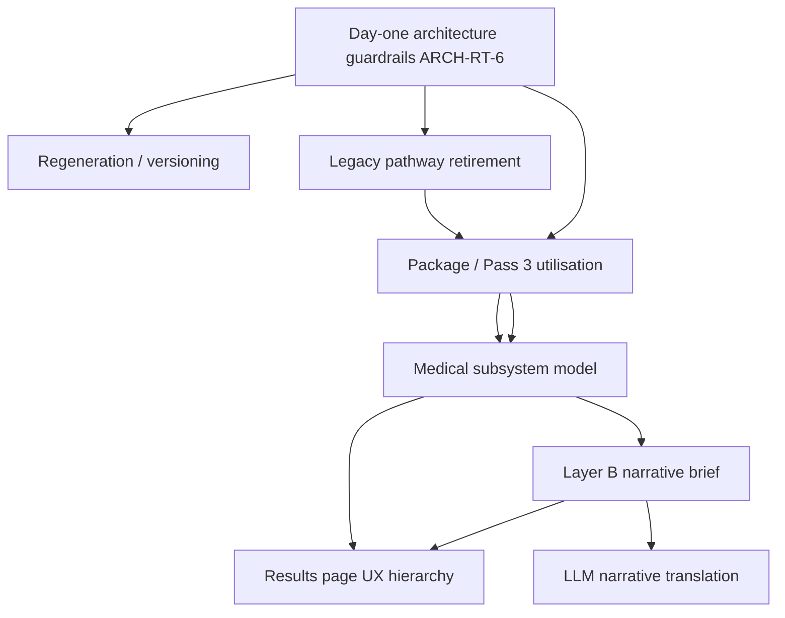

# PROGRAMME-STATUS-1 — HealthIQ Launch Workstream Consolidation Audit

**work_id:** `PROGRAMME-STATUS-1_healthiq_launch_workstream_consolidation_audit`  
**branch:** `work/PROGRAMME-STATUS-1-healthiq-launch-workstream-consolidation-audit`  
**Generated:** 2026-05-31  
**Mode:** Audit only — no production code, package, schema, test, or medical content changes made.

---

## 1. Executive summary

### What is complete

- **Day-one architecture guardrail stream (ARCH-RT-6)** is closed: `validate_day_one_architecture.py`, architecture regression tests, and `sentinel/packs/day_one_architecture_guardrails_v1.json` enforce card evidence, hypothesis promotion rules, signal identity, provenance classification, PSI deferral, and no raw Pass 3 runtime reads.
- **Wave 1 launch gate (ARCH-RT-5)** delivered M1–M7 milestones including package provenance classification (186/186), seven compiled health-system card artefacts in `knowledge_bus/compiled/health_system_cards/`, one runtime-promoted compiled hypothesis (`signal_vitamin_d_low`), and launch-readiness acceptance (`accepted_for_wave1_launch`).
- **Launch-core proving slice (LC-S1–S9, LAUNCH-CORE-0/1/1B)** validated card completeness coherence, consumer copy scrubbing, and post-fix UAT on representative panels.
- **Results journey restructuring (FE-R1, FE-R2, FE-R3–R6 partial)** moved primary finding earlier, removed the open “What this means” accordion trap, fixed major backend compiler prose defects, and added frontend retail sanitization.
- **Layer B → Layer C boundary** is formally decided in Pre-Sprint 1 §3.9; `NarrativePayloadV1` and ADR WP2 Path B exist as the typed handoff scaffold.
- **Result immutability policy (LAUNCH-CORE-3)** is documented; stale detection metadata exists on GET.

### What is partially complete

- **Day-one architecture programme overall:** launch slice accepted, but the carry-forward register in `docs/sprints/healthiq_day_one_architecture_rework_sprint_plan_FINAL_updated.md` §H explicitly states day-one is **not fully delivered** until explicit provenance, activation compile, multi-frame root-cause, PSI decision-or-wire, and estate-wide research→runtime traceability are resolved or classified.
- **Pass 3 / package intelligence utilisation:** signal firing uses governed packages; hypotheses, contradictions, `relationship_kind`, and rich `explanation.*` are largely **not consumed** by cards, subsystem evidence UX, or report surfaces (`PASS3_research_asset_utilisation_investigation_cursor.md`).
- **Health systems / subsystem medical model:** compiled card evidence with marker roles exists (ARCH-RT-5B), but **does not implement** the v1 medical target in `healthiq_wave1_health_systems_subsystem_medical_review.md` (thin subsystems still scored-visible; liver still split; `visibility_tier` not enforced downstream).
- **Results-page narrative and hierarchy:** structural journey improved, but score-family competition, repetition, and partial-data score confusion remain (`LAUNCH-CORE-4_results_page_narrative_hierarchy_and_score_rationalisation_audit.md`). Frontend scrub hides some backend defects rather than eliminating them.
- **Layer B narrative brief maturity:** `NarrativePayloadV1` provides default section intents and claim boundaries, but per-section narrative intent and wording boundaries are **not yet rich or complete** relative to §3.9 groups 4–5 (`healthiq_pre_sprint3_closure_pack_FINAL.md` originally flagged gaps; partial WP2 closure since then).

### What is still immature

- **Full medical intelligence on user-facing cards:** subsystem rows are marker checklists with roles on compiled path only; Pass 3 hypothesis ranking, contradiction logic, and mechanism prose are stranded.
- **Subsystem UX vs medical review:** CRP-only “vascular strain”, homocysteine-only scored subsystem, liver “processing context” scored subsystem — all flagged as trust risks in medical review — remain in compiled artefacts and UI.
- **LLM narrative translation:** production defaults to `deterministic_mock`; Gemini path exists but is not launch-ready as a governed translation layer.
- **Regeneration / versioned results:** policy locked; `result_version_id`, content hashes, and estate stamps largely **gap** per LAUNCH-CORE-3 metadata table.
- **Cross-section narrative coherence guards:** Sentinel contradiction/coherence tests remain placeholders (`LAUNCH_GRADE_ANALYTICAL_GAP_MAP_2026-05.md`).

### What is blocked

- **Estate-wide explicit `source_spec_id` on all 186 packages:** classified deferred; 0 explicit manifest fields (`active_intelligence_authority_manifest.md`).
- **kb52c / batch JSON package cohort (142 packages):** `batch_json_blocked_pending_spec_extraction` — not launch-blocking for current slice but blocks “full estate” claims.
- **PSI runtime wiring:** explicitly `deferred_non_launch_blocker` (ARCH-RT-5E); loader exists for validation only.
- **Multi-frame root-cause promotion:** blocked pending frame-selection policy (ARCH-RT-5C, ARCH-RT-6).
- **LLM narrative design (F):** blocked on Layer B brief maturity and medical/subsystem model stability.

### What should be worked on next

**Primary recommendation: C — health systems/subsystems medical review completion.**

The governed medical target model exists (`healthiq_wave1_health_systems_subsystem_medical_review.md`) but is not yet authoritative in compiled card artefacts, assembler filtering, or frontend surfacing. Until thin subsystems are collapsed/hidden and marker-role taxonomy is enforced at the visibility tier, results-page UX work will keep polishing symptoms of an medically over-specific subsystem model.

**Secondary (sequenced immediately after C): B — full research intelligence utilisation audit/fix**, scoped to compile Pass 3 richness into governed card/subsystem DTO fields — not raw runtime reads.

---

## 2. Programme completion matrix

### Programme 1 — Day-one re-architecture programme

| Field | Assessment |
|-------|------------|
| **Original intended purpose** | Move from fragmented research/runtime architecture to governed research→compile→runtime→DTO→frontend path before launch (`HealthIQ_As-Is_to_Day-One_Architecture_Transition_Plan_v3.md`, `healthiq_day_one_architecture_rework_sprint_plan_FINAL_updated.md`). |
| **Key sprint/work IDs found** | ARCH-RT-0 … ARCH-RT-6; ARCH-RT-5B/5C/5D/5E; LAUNCH-CORE-3; WAVE1-EQUIV1; DOMAIN-UX1A–1D (card vertical slice). |
| **Key artefacts found** | `docs/audit-papers/day_one_architecture_launch_readiness_audit.md`, `ARCH-RT-6_day_one_architecture_acceptance_audit.md`, `active_intelligence_authority_manifest.md`, `knowledge_bus/compiled/estate_index_v1.yaml`, `backend/scripts/validate_day_one_architecture.py`, `sentinel/packs/day_one_architecture_guardrails_v1.json`, ADR-RT-001–003, ARCH-RT-5* audit series. |
| **Implementation status** | Launch slice complete with compiled card estate (7), one promoted compiled hypothesis, classified package provenance, validator/Sentinel guardrails. Carry-forward items (activation compile authority, estate-wide explicit provenance, multi-frame root-cause, PSI) remain open or deferred. |
| **Guardrail status** | **Strong** for Wave 1 launch slice — programmatic fail-closed validator + Sentinel pack + architecture tests. |
| **Open risks** | Dual authority paths (legacy root-cause YAML vs compiled hypothesis); `wave1_subsystem_evidence.py` retains hard-coded fallback defs; batch JSON packages unextracted; inferred provenance on card markers (RT5D-CARD-001–005). |
| **Launch impact** | **Non-blocking** for bounded Wave 1 pilot if deferred register accepted; **blocking** for “day-one fully delivered” or estate-wide regeneration claims. |
| **Completion rating** | **Mostly complete** (launch slice) / **Partially complete** (programme completion criteria §H) |
| **Evidence** | Launch verdict 2026-05-30; ARCH-RT-6 `accepted_for_wave1_launch`; carry-forward register §A–H still lists 9 completion criteria not all satisfied. |
| **Recommended next action** | Dedicated **legacy architecture cleanup / classification audit (A)** after medical model (C) — retire or reclassify dual-path modules, close RT5D register items tied to launch-critical claims. |

---

### Programme 2 — Full medical intelligence utilisation (Pass 3 / packages)

| Field | Assessment |
|-------|------------|
| **Original intended purpose** | Ensure governed research assets (Pass 3 investigation specs → packages → runtime) deliver full medical intelligence to product surfaces, not just signal activation thresholds. |
| **Key sprint/work IDs found** | KB-S52* ingest tranche; PASS3 investigation (`PASS3_research_asset_utilisation_investigation_cursor.md` / `_claude.md`); ARCH-R1 reviews; ARCH-RT-5B card evidence; proposed `DOMAIN-UX1D-pass3-subsystem-evidence-compile` / `KB-S63`. |
| **Key artefacts found** | 9 `*_Pass_3.json` files (153 specs); 186 `knowledge_bus/packages/**`; `promoted_signal_intelligence.yaml` (KB47 subset, unused at runtime); `PASS3_research_asset_utilisation_investigation_cursor.md`; `ARCH-R1_research_asset_to_runtime_intelligence_architecture_review*.md`. |
| **Implementation status** | **Pass 3 → packages:** moderate for signal logic (132/186 cite Pass 3); hypotheses/contradictions/ranking **lost** in standard package path. **Packages → runtime:** partial — evaluator uses activation/overrides; `explanation.*` stored in insight graph but **not consumed** by cards/reports. PSI **not consumed**. |
| **Guardrail status** | Package schema validation and day-one validator prevent raw Pass 3 runtime reads. **No guard** that card surfaces use available package richness. |
| **Open risks** | Duplicate `signal_id` overwrite across packages; legacy 1.0.0 packages (44) lack structured supporting_metrics; CRP still from legacy `pkg_s24_crp_high_inflammation` not dedicated Pass 3 specs. |
| **Launch impact** | Product under-delivers research investment on cards; trust risk when UI implies specificity unsupported by surfaced evidence. Not a runtime safety blocker if signals fire correctly. |
| **Completion rating** | **Partially complete** |
| **Evidence** | PASS3 audit §1 verdict “only partially using Pass 3”; runtime table shows `explanation.*` stored-only; `relationship_kind` lost except unused PSI files. |
| **Recommended next action** | **B — research intelligence utilisation sprint:** extend governed compile artefact (card evidence v2 or subsystem compile) from Pass 3 / 2.0.0 packages; wire `explanation.*` and roles to DTO; do **not** read raw JSON in orchestrator. |

---

### Programme 3 — `healthiq_wave1_health_systems_subsystem_medical_review`

| Field | Assessment |
|-------|------------|
| **Original intended purpose** | Define medically safe v1 subsystem visibility: which subsystems may be scored vs contextual vs hidden; marker role taxonomy; liver flat card; rename lipid subsystem (`healthiq_wave1_health_systems_subsystem_medical_review.md`). |
| **Key sprint/work IDs found** | DOMAIN-UX1A, 1A-PATCH, 1B, 1C, 1D; ARCH-RT-3/5B; WAVE1_subsystem investigations; MAP-R1A bilirubin fix. |
| **Key artefacts found** | `docs/audit-papers/healthiq_wave1_health_systems_subsystem_medical_review.md`, compiled cards under `knowledge_bus/compiled/health_system_cards/`, `backend/core/knowledge/health_system_card_evidence.py`, `wave1_subsystem_evidence.py`, `WAVE1_subsystem_coverage_and_marker_role_codebase_investigation_cursor.md`. |
| **Implementation status** | **Implemented in code** as 7 subsystems across 3 domains with compiled marker roles (ARCH-RT-5B). **Not aligned with medical review:** homocysteine remains `visibility_tier: scored_subsystem`; vascular strain contextual but still visible; liver remains split with `wave1_liv_processing_context` scored; labels still “Lipid transport”, “Insulin and metabolic context”. `visibility_tier` field exists on compiled YAML and DTO type but **not filtered** in assembler or frontend. |
| **Guardrail status** | Sentinel DOMAIN-UX1A–1D guards prevent frontend-invented roles; day-one validator requires compiled routing. **No guard** enforcing medical review visibility policy. |
| **Open risks** | Over-trust in thin subsystems (CRP-only, homocysteine-only); liver biology oversimplified; domain completeness vs subsystem chip mismatch; `total_bilirubin` forbidden in compiler but medical review bilirubin equivalence still confuses users. |
| **Launch impact** | **High trust risk** — UI can imply clinical specificity beyond marker support; LAUNCH-CORE-1B passed card coherence but noted IDL “Vascular Inflammation Risk” label persists. |
| **Completion rating** | **Partially complete** (engineering) / **Immature** (medical alignment) |
| **Evidence** | Medical review §8–9 vs `wave1_cv_homocysteine_pathway.yaml` (`scored_subsystem`); `wave1_liv_processing_context.yaml` (`scored_subsystem`); grep shows no `visibility_tier` consumption in `domain_score_assembler.py` or results components. |
| **Recommended next action** | **C — medical review completion sprint:** recompile/reclassify card artefacts to medical v1 model; enforce `visibility_tier` in Layer B; rename consumer labels; collapse liver to flat scored card with optional evidence groups only. |

---

### Programme 4 — Frontend results ordering and narrative

| Field | Assessment |
|-------|------------|
| **Original intended purpose** | Deliver coherent guided reasoning journey: primary finding → why → confidence → systems → evidence → next steps; govern score hierarchy; prepare for optional LLM translation without Layer C reasoning. |
| **Key sprint/work IDs found** | LC-S3 (Layer C payload), LC-S4–S7, LAUNCH-CORE-0/1/1B/4; FE-R0–R6A; DOMAIN-UX1*; `HealthIQ_Final_Results_Journey_Recommendation_Paper_v6` (reference). |
| **Key artefacts found** | `frontend/app/(app)/results/page.tsx`, `FE_R0_results_page_prose_source_trace_audit.md`, `FE-R1`/`FE-R2` notes, `LAUNCH-CORE-4_results_page_narrative_hierarchy_and_score_rationalisation_audit.md`, `LAUNCH-CORE-1B_results_page_post_fix_uat_audit.md`, `DOMAIN_NARRATIVE_CONTRACT_WAVE1.md`. |
| **Implementation status** | Current order (FE-R2 Phase 1): body overview/hero → primary finding → working well → health system cards → uncertainty → patterns → markers → next steps. Major FE-R1 backend prose fixes merged; frontend scrub (`retailNarrativeSanitize`, hero shaping). Remaining: score hierarchy confusion (6+ score families), repetition, biomarker 0–100 scores visible, stale banner gap (`incompatible` not shown), partial-data 100/100 blood sugar tension. |
| **Guardrail status** | FE-R1 Sentinel classes; LC-S11A trust blockers; slug leakage regression. **Weak** on cross-section coherence and score precedence. |
| **Open risks** | Polishing layout before subsystem medical model stable; regenerate button would preserve bad hierarchy (LAUNCH-CORE-4); deterministic prose still depends on IDL labels backend has not fully retail-normalized. |
| **Launch impact** | **Non-blocking** for pilot with reservations; **blocking** for premium consumer credibility at scale. |
| **Completion rating** | **Partially complete** |
| **Evidence** | LAUNCH-CORE-4 “PASS WITH RESERVATIONS”; current `page.tsx` L666–732 order; LAUNCH-CORE-1B PASS WITH RESERVATIONS on copy. |
| **Recommended next action** | **E — results-page UX redesign** only **after C + partial B + score rationalisation spec**; limited FE copy/order tweaks safe now; full redesign is downstream. |

---

## 3. Dependency map

### Cross-cutting dependency answers

| Question | Answer |
|----------|--------|
| **Can results-page narrative work continue safely before full research intelligence utilisation is confirmed?** | **Limited yes, full no.** Order/ scrub / deduplication (FE-R*, LAUNCH-CORE-4) can proceed without full Pass 3 utilisation, but **subsystem/card narrative quality** will remain capped until research richness is compiled into DTOs (B). Risk: UX sprint encodes wrong subsystem story (e.g. scored homocysteine pathway) that must be reworked after C/B. |
| **Can UX polish continue before subsystem medical review/core-support model is confirmed?** | **No for card/subsystem surfaces.** Polishing hero and journey order is safe; changing card prominence, labels, or subsystem expansion **should wait** for C. Medical review explicitly prescribes architecture-first sequence (§10). |
| **Can LLM narrative translation be designed before Layer B narrative brief maturity is confirmed?** | **No.** §3.9 groups 4–5 (section intent, wording boundaries) are prerequisites. `NarrativePayloadV1` is a scaffold, not a mature brief. LLM design (F) is **blocked** until D completes. |
| **Are old architecture pathways sufficiently retired/guarded?** | **Partially.** Day-one validator blocks new drift and raw Pass 3 reads; legacy root-cause YAML (40 signals), dual loader paths, batch packages, and hard-coded fallback in `wave1_subsystem_evidence.py` remain **reachable but classified**. Unguarded **product risk** is medical over-surfacing, not silent wrong signal firing. Dedicated cleanup sprint (A) still warranted. |

---

## 4. Research intelligence utilisation assessment

| Question | Answer |
|----------|--------|
| **Are Pass 3 research files used by runtime artefacts?** | **No directly.** Pass 3 JSON is ingest/audit source only. Runtime loads `signal_library.yaml` / packages and compiled card YAML — not `*_Pass_3.json`. |
| **Are packages using full research richness or a subset?** | **Subset.** Activation, overrides, structured supporting_metrics (2.0.0), research_brief citations, and merged `explanation.*` are preserved in packages. **Lost:** hypotheses[], contradiction_markers, hypothesis_ranking, relationship_kind (standard path), per-hypothesis missing_data policy, Pass 3 confirmatory_tests. |
| **Is the package/compiled artefact pipeline authoritative?** | **Yes for Wave 1 launch slice** — `estate_index_v1.yaml` and `active_intelligence_authority_manifest.md` declare compiled card evidence and one compiled hypothesis as launch authority; validator enforces. **Not authoritative for full 153-spec estate** — 142 batch JSON packages blocked; legacy s24 paths remain for some signals (e.g. CRP). |
| **What richness is stranded in source research files?** | Ranked hypotheses, contradiction logic, relationship_kind semantics, missing-data policies, confirmatory test rationales, mechanism/pathway/implications prose (in Pass 3 `narrative` and pkg `explanation.*` unread by cards), PSI overlay (20 KB47 packages, runtime-dead). |
| **What must be done before claiming full medical intelligence utilisation?** | (1) Governed compile from Pass 3/2.0.0 → card/subsystem DTO with roles, rationales, visibility tiers; (2) resolve duplicate `signal_id` policy; (3) migrate legacy s24 signals with dedicated Pass 3 specs where clinically required; (4) wire consumption in Layer B assemblers — not frontend; (5) optional PSI join only if launch-critical and provenance-safe. |

**Evidence anchors:** `PASS3_research_asset_utilisation_investigation_cursor.md` §1–4; `ARCH-R1_research_asset_to_runtime_intelligence_architecture_review_cursor.md`; `active_intelligence_authority_manifest.md` PSI table.

---

## 5. Health systems/subsystems medical review assessment

| Question | Answer |
|----------|--------|
| **Are core and support systems medically reviewed?** | **Yes** — comprehensive review in `healthiq_wave1_health_systems_subsystem_medical_review.md` (2026). |
| **Are they implemented in code?** | **Partially** — 7 compiled subsystems with marker roles exist; implementation **diverges** from review recommendations (scored vs hidden tiers). |
| **Are they surfaced correctly to users?** | **No** — medical review recommends only **one scored CV subsystem (atherogenic lipid)**, one scored glycaemic subsystem, **flat liver**; current UI surfaces **three CV + two metabolic + two liver** subsystems with scores on domain cards. |
| **Are support systems being over-surfaced?** | **Yes** — homocysteine pathway scored; vascular strain visible; insulin/metabolic context with TG-only; liver processing scored. |
| **Are any user-facing body system cards medically immature?** | **Yes** — CRP-only vascular strain, homocysteine-only pathway, liver processing context (mixed biology), blood sugar 100/100 with 2/4 markers. |
| **Does the results page expose system/subsystem logic before clinical/narrative maturity?** | **Yes** — Health Systems Cards are in main journey (post FE-R2 Phase 1) with expandable subsystem evidence (DOMAIN-UX1D) before medical model alignment. |

**Medical review vs compiled artefact examples:**

| Subsystem | Medical review | Current compiled `visibility_tier` |
|-----------|----------------|-----------------------------------|
| Atherogenic lipid (rename from lipid transport) | Scored visible | `wave1_cv_lipid_transport` — scored, old label |
| Homocysteine pathway | Hide/defer contextual | `scored_subsystem` |
| Vascular strain / CRP | Hide/defer contextual | `contextual_evidence` (visible, not hidden) |
| Glycaemic control | Scored with caveats | Scored — aligned with caveats |
| Insulin-resistance context | Hide unless richer markers | Scored subsystem with TG-only risk |
| Liver enzyme pattern | Evidence group, not scored | `scored_subsystem` |
| Liver processing | Merge/hide | `scored_subsystem` |

---

## 6. Results-page narrative assessment

*Does not repeat FE-R0 / LAUNCH-CORE-4 verbatim — focuses on upstream dependencies.*

### Primary drivers of poor narrative (ranked)

| Driver | Weight | Notes |
|--------|--------|-------|
| **Incomplete system/subsystem medical review (C)** | **High** | Cards interrupt story with medically thin scored subsystems; contributor copy repeats vascular/homocysteine themes. |
| **Incomplete medical intelligence utilisation (B)** | **High** | Subsystem sections show marker chips without mechanism, contradiction, or hypothesis context available in Pass 3/packages. |
| **Layer B narrative assembly** | **Medium–High** | Multiple surfaces emit lead pattern (hero, body overview, primary finding, IDL patterns); backend duplication not fully deduplicated despite FE-R1. |
| **Too many analytical surfaces exposed at once** | **Medium** | System scores, marker scores, severity badges, completeness metrics, IDL patterns — LAUNCH-CORE-4 score inventory still largely valid. |
| **Missing narrative brief contract maturity (D)** | **Medium** | No per-section governed intent/claim boundaries consumed by compilers at full §3.9 richness. |
| **Deterministic hard-coded prose limitations** | **Medium** | IDL retail labels and narrative compiler templates still produce internal-adjacent copy (“Vascular Inflammation Risk”); scrub masks persistently. |
| **Frontend layout alone** | **Lower than previously thought** | FE-R2 fixed major ordering bug (primary finding before cards in current `page.tsx`); remaining issues are mostly **content and hierarchy policy**, not component absence. |

### Is poor narrative mainly frontend layout?

**No.** Layout improved; remaining weakness is **upstream truth model + copy sources + score policy**, with frontend scrub as a temporary shield.

---

## 7. Legacy architecture cleanup assessment

### Classification register

| Category | Items | Notes |
|----------|-------|-------|
| **Deleted** | None confirmed at scale in this audit pass | Programme prefers classify-over-delete |
| **Retained but unreachable** | Raw Pass 3 JSON at runtime (blocked by validator); PSI loader in production orchestrator (not imported) | Guarded |
| **Retained and explicitly classified** | 186 packages in ARCH-RT-5D register; deferred PSI; batch JSON 142; legacy root-cause YAML (40 signals); compiled hypothesis (1 promoted) | `ARCH-RT-5D_unresolved_provenance_register.md`, `active_intelligence_authority_manifest.md` |
| **Guarded by validator/Sentinel** | Card evidence paths, no raw Pass 3 reads, compile manifest refs for launch artefacts, frontend subsystem isolation (DOMAIN-UX1D), day-one architecture pack | Strong for launch slice |
| **Still reachable** | `load_root_cause_hypotheses.py` legacy YAML path; `wave1_subsystem_evidence.py` hard-coded `_Wave1SubsystemDef` fallback (unused when compiled row returns); legacy s24 packages in signal registry; duplicate signal_id last-wins in evaluator | Classified but active |
| **Unguarded risk** | Medical over-surfacing of thin subsystems; duplicate completeness metrics (trust strip vs card ratios); `incompatible` result_versioning not shown in UI; inferred card marker provenance treated as explicit in product narrative | Product/trust risk, not silent engine corruption |

### Dedicated cleanup sprint needed?

**Yes — audit-first then implementation (A).** ARCH-RT-6 prevents new drift but does not remove dual authorities. Recommend: inventory reachable legacy paths → classify retire/defer → remove hard-coded fallback defs once medical model stable → close RT5D batch extraction or permanently defer with user-facing scope statement.

---

## 8. Layer architecture readiness

| Layer | Intended role | Readiness | Evidence |
|-------|---------------|-----------|----------|
| **Layer A — Governed medical intelligence inputs** | SSOT, packages, Pass 3 compile, canonical biomarkers, reference ranges | **Mostly ready for launch slice** | 186 packages; 7 compiled card artefacts; unit governance LC-S8*; provenance classified |
| **Layer B — Interpretation, prioritisation, narrative planning, DTO shaping** | AnalysisDTO, narrative payload, root cause, domain scores, clinician report | **Partially ready** | Rich DTO exists; `NarrativePayloadV1` partial; top_findings/root_cause still nested in meta in places; subsystem/medical model not final |
| **Layer C — Presentation/rendering only** | Frontend render, deterministic narrative compiler, optional LLM translation | **Mostly compliant for deterministic path** | FE-R1/R2; AGENTS.md frontend-shell rules; mock-mode disclosure; **must not** perform LLM reasoning — currently satisfied in production default |

### LLM narrative readiness (cross-cutting §7)

| Question | Answer |
|----------|--------|
| **Is Layer B producing a sufficiently governed narrative brief?** | **Not yet.** `NarrativePayloadV1` exists with default section intents and claim boundaries; not section-specific rich intents or prohibited-claim enforcement at compiler consumption depth required by §3.9. |
| **Is the LLM role defined in existing docs?** | **Yes** — Pre-Sprint 1 §3.9, strategy v1.5, ADR WP2: translation only; `validate_llm_output_v2` guard; production defaults to deterministic_mock. |
| **What must exist before LLM narrative translation is wired?** | Mature Layer B brief (groups 1–5); medical/subsystem model stable; validator extended for ranking/hypothesis/wording preservation; explicit product decision to enable Gemini path; regeneration/version stamps for safe replay. |
| **Layer C must not perform LLM reasoning** | **Confirmed as policy**; current production path uses deterministic compilers + frontend scrub. Risk is future sprint bypassing payload contract — guard via D + validator review. |

---

## 9. Recommended prioritised roadmap

| Order | work_id suggestion | Purpose | Why next | Dependencies | Risk | Type |
|-------|-------------------|---------|----------|--------------|------|------|
| **1** | `MED-REV-1_wave1_subsystem_visibility_and_label_alignment` | Implement medical review v1: visibility tiers, rename labels, collapse liver, downgrade thin subsystems to contextual/hidden | Stops trust erosion from over-specific cards; unblocks honest UX | Medical review doc; compiled card YAML; `health_system_card_evidence.py` | STANDARD | Implementation |
| **2** | `KB-UTIL-1_pass3_card_evidence_compile_and_consume` | Compile Pass 3 / pkg richness (roles, rationales, optional mechanism lines) into governed card DTO; consume in Layer B | Delivers research ROI on cards; depends on stable visibility model from (1) | MED-REV-1; PASS3 audit; package 2.0.0 | MEDIUM | Implementation |
| **3** | `LAYER-B-1_narrative_brief_maturity` | Complete §3.9 groups 4–5 in `NarrativePayloadV1` builders; wire into narrative compiler; extend `validate_llm_output_v2` review | Required before any LLM translation; reduces duplicate prose surfaces | KB-UTIL-1 partial; clinician report stable | STANDARD | Implementation |
| **4** | `ARCH-LEGACY-1_pathway_retirement_audit` | Classify and retire dual paths (legacy root-cause YAML migration plan, wave1 hard-coded fallback, batch JSON scope) | Reduces long-term drift; safe after medical model locked | ARCH-RT-6 baseline; MED-REV-1 | STANDARD | Audit then implementation |
| **5** | `LAUNCH-UX-2_results_hierarchy_and_score_rationalisation` | Score precedence policy, dedupe metrics, collapse marker 0–100 default, stale banner fix | Symptom fix **after** upstream model; LAUNCH-CORE-4 backlog | MED-REV-1; LAYER-B-1 partial | STANDARD | Implementation |
| **6** | `LLM-NAR-0_translation_design_audit` | Design-only: Gemini envelope, validator contract, rollout gates | Must not implement wire before (3) | LAYER-B-1 | STANDARD | Audit-only |
| **7** | `LAUNCH-CORE-5_versioned_regeneration_implementation` | Behaviour C from LAUNCH-CORE-3: regen job, version rows, estate stamps | After analytical surfaces stable; avoids regenerating bad UX | LAUNCH-UX-2; content hashes policy | MEDIUM | Implementation |

**Roadmap principle:** Do not run **E (full UX redesign)** or **F (LLM design/wire)** before **C → B → D**. Do not run **G (regeneration)** before user-visible hierarchy stabilizes.

---

## 10. Key decision required

### Recommended next sprint: **C — health systems/subsystems medical review completion**

| Option | Recommendation | Rationale |
|--------|----------------|-----------|
| **A. Legacy architecture cleanup** | **Second** — audit-first sprint after C | Guardrails exist; cleanup is important but not the highest trust lever for launch narrative |
| **B. Full research intelligence utilisation** | **Immediately after C** | Cannot safely compile Pass 3 richness onto wrong visibility model |
| **C. Medical review completion** | **NEXT** | Review exists; implementation diverges; blocks trustworthy cards and constrains B and E |
| **D. Layer B narrative brief** | **Third** | Prerequisite for LLM; reduces prose duplication once subsystem truth stable |
| **E. Results-page UX redesign** | **Fifth** — limited polish only until C/B/D progress | LAUNCH-CORE-4 issues largely upstream-driven |
| **F. LLM narrative translation design** | **Sixth — audit-only first** | Blocked on D; policy clear, implementation premature |
| **G. Regeneration/versioned result flow** | **Seventh** | Policy done (LAUNCH-CORE-3); implementation should not preserve current hierarchy |

---

## 11. Key repo artefacts index (audit trail)

### Day-one / architecture

- `docs/planning-papers/HealthIQ_As-Is_to_Day-One_Architecture_Transition_Plan_v3.md`
- `docs/sprints/healthiq_day_one_architecture_rework_sprint_plan_FINAL_updated.md`
- `docs/audit-papers/day_one_architecture_launch_readiness_audit.md`
- `docs/audit-papers/ARCH-RT-6_day_one_architecture_acceptance_audit.md`
- `docs/audit-papers/active_intelligence_authority_manifest.md`
- `docs/architecture/ADR-RT-001_research_to_runtime_day_one_architecture.md`
- `backend/scripts/validate_day_one_architecture.py`

### Pass 3 / packages / intelligence

- `docs/audit-papers/PASS3_research_asset_utilisation_investigation_cursor.md`
- `docs/architecture/ARCH-R1_research_asset_to_runtime_intelligence_architecture_review_cursor.md`
- `knowledge_bus/research/investigation_specs/multi_llm_research/*_Pass_3.json`
- `knowledge_bus/packages/**` (186 directories)
- `knowledge_bus/compiled/estate_index_v1.yaml`

### Medical review / subsystems

- `docs/audit-papers/healthiq_wave1_health_systems_subsystem_medical_review.md`
- `docs/audit-papers/WAVE1_subsystem_coverage_and_marker_role_codebase_investigation_cursor.md`
- `docs/audit-papers/DOMAIN-UX1A_wave1_health_systems_card_scaffold_notes.md` through `DOMAIN-UX1D_*`
- `knowledge_bus/compiled/health_system_cards/*.yaml`
- `backend/core/knowledge/health_system_card_evidence.py`
- `backend/core/analytics/wave1_subsystem_evidence.py`

### Results narrative / frontend

- `docs/audit-papers/FE_R0_results_page_prose_source_trace_audit.md`
- `docs/audit-papers/FE-R1_consumer_prose_cleanup_narrative_safety_notes.md`
- `docs/audit-papers/FE-R2_results_journey_restructure_notes.md`
- `docs/audit-papers/LAUNCH-CORE-4_results_page_narrative_hierarchy_and_score_rationalisation_audit.md`
- `docs/audit-papers/LAUNCH-CORE-1B_results_page_post_fix_uat_audit.md`
- `frontend/app/(app)/results/page.tsx`
- `docs/intelligence/DOMAIN_NARRATIVE_CONTRACT_WAVE1.md`

### Layer B/C / LLM

- `docs/planning-papers/healthiq_pre_sprint1_decision_pack_FINAL.md` §3.9
- `docs/planning-papers/healthiq_pre_sprint3_closure_pack_FINAL.md` §4
- `docs/architecture/ADR_WP2_layer_b_layer_c_contract_path_b.md`
- `backend/core/contracts/narrative_payload_v1.py`
- `backend/core/analytics/narrative_payload_builder_v1.py`
- `backend/core/llm/validator_v2.py`

### Legacy / provenance / versioning

- `docs/audit-papers/ARCH-RT-5D_unresolved_provenance_register.md`
- `docs/audit-papers/LAUNCH-CORE-3_result_versioning_replay_and_regeneration_audit.md`
- `docs/audit-papers/LAUNCH_GRADE_ANALYTICAL_GAP_MAP_2026-05.md`
- `sentinel/packs/day_one_architecture_guardrails_v1.json`

### Programme steering

- `docs/audit-papers/TRANSFORMATION_PROGRAMME_BRIEF_2026-05.md`
- `docs/planning-papers/healthiq_launch_core_transformation_plan_FINAL.md`

---

## 12. Success criteria checklist

| Criterion | Met |
|-----------|-----|
| 1. All four named programmes assessed | **Yes** — §2 |
| 2. Key repo artefacts identified | **Yes** — §11 |
| 3. Completion status clearly classified | **Yes** — §2 ratings |
| 4. Dependencies mapped | **Yes** — §3 |
| 5. Unresolved legacy architecture risk classified | **Yes** — §7 |
| 6. Research intelligence utilisation status clear | **Yes** — §4 |
| 7. Subsystem medical review status clear | **Yes** — §5 |
| 8. Next sprint priority recommended | **Yes** — §10 (**C**) |
| 9. No implementation changes made | **Yes** — audit-only |

---

*End of PROGRAMME-STATUS-1 consolidation audit.*
