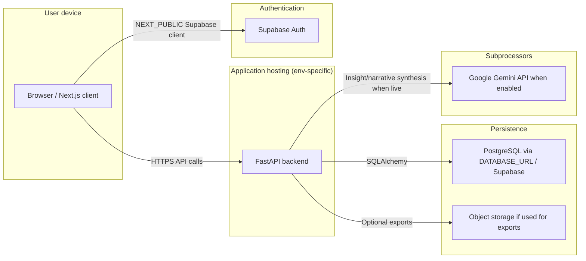

# Data flow — launch product (Phase 1)

**Purpose:** Practical map of **launch-relevant** personal and health data for governance review.  
**Not:** A full enterprise data-lineage system.

---

## 1. High-level diagram

---

## 2. Step-by-step lifecycle

| Step | Flow | Code / config anchor (indicative) |
|------|------|-------------------------------------|
| 1 | User registers or logs in | Supabase client on frontend; backend validates JWT (`SecurityConfig`) |
| 2 | User uploads lab results or pastes data | Request hits FastAPI; parsing pipeline processes content |
| 3 | Analysis runs | Results stored in `Analysis` / `AnalysisResult` models (`backend/core/models/database.py`) |
| 4 | User views interpretation and reports | Read from persisted results; UI in `frontend/app` |
| 5 | Optional LLM path | Synthesis may call Gemini when configured (`core/insights/synthesis.py`); **health-related text may leave infra to Google** |
| 6 | Account / rights | Consent and deletion constructs at schema level; **operational fulfilment** is separate |

---

## 3. Boundaries

- **In scope:** Data the product intentionally processes for B2C interpretation.
- **Out of scope for this diagram:** Internal developer-only test fixtures, CI-only data, unless misconfigured into production.

---

## 4. Assumptions vs verified

| Topic | In repo? | Action |
|-------|----------|--------|
| Exact cloud regions | No | Document in ops + vendor consoles |
| Encryption at rest for DB | Depends on provider | Supabase/project settings |
| Log redaction | Implementation-specific | Define in logging/incident docs |

See `docs/ops/UK_HOSTING_AND_RESIDENCY_PHASE1.md` and `docs/ops/VENDOR_SUBPROCESSOR_INVENTORY_PHASE1.md`.
