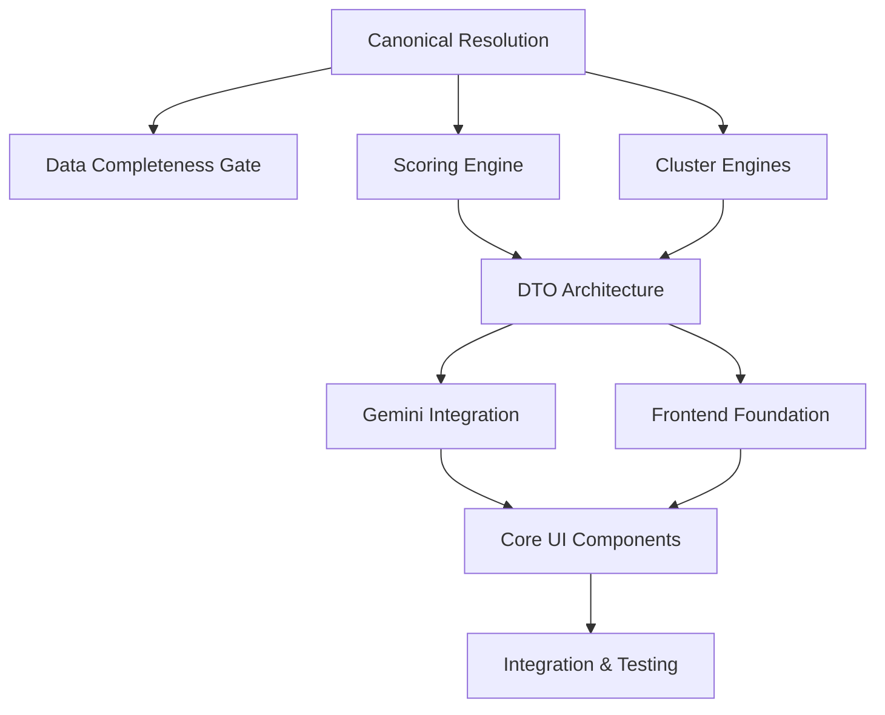

# 🚀 HealthIQ AI v5 - Implementation Plan

> **Implementation Blueprint**: This document defines the complete development roadmap for HealthIQ AI v5, including build phases, sprint strategy, team responsibilities, and testing milestones.

---

## 📋 Executive Summary

This implementation plan outlines a **10-sprint development cycle** (20 weeks) to deliver HealthIQ AI v5, a precision biomarker intelligence platform. The plan is structured around the **10-stage Intelligence Lifecycle** with clear dependencies, parallelization opportunities, and comprehensive testing integration.

**Key Metrics:**
- **Total Duration**: 20 weeks (10 sprints × 2 weeks)
- **Core Team**: Backend (Cursor), Frontend (Lovable.dev), AI Integration (Shared)
- **Testing Strategy**: Unit → Integration → E2E → Performance → Security
- **Agent Integration**: PRP-based feature development with MCP-style RAG capabilities

---

## 🏗️ Core Build Phases

### Phase 1: Foundation & Data Pipeline (Sprints 1-3)

#### **Sprint 1-2: Canonical ID Resolution & SSOT Infrastructure**
**Duration**: 4 weeks | **Dependencies**: None | **Parallelizable**: ✅

**Components:**
- `core/canonical/normalize.py` - Biomarker alias resolution
- `core/canonical/resolver.py` - Unit conversion and reference ranges  
- `ssot/biomarkers.yaml` - Canonical biomarker definitions
- `ssot/units.yaml` - Unit conversion tables
- `ssot/ranges.yaml` - Population-specific reference ranges

**Deliverables:**
- [ ] Complete SSOT YAML schema validation
- [ ] Canonical ID resolution with 95%+ accuracy
- [ ] Unit conversion engine with comprehensive coverage
- [ ] Reference range lookup by age/sex/population
- [ ] Full test coverage with edge case handling

**Success Criteria:**
- All biomarker aliases resolve to canonical IDs
- Unit conversions maintain precision to 4 decimal places
- Reference ranges support 18+ age groups, both sexes, 3+ ethnicities

---

#### **Sprint 3: Data Completeness Gate & Validation**
**Duration**: 2 weeks | **Dependencies**: Canonical Resolution | **Parallelizable**: ✅

**Components:**
- `core/pipeline/context_factory.py` - Analysis context creation
- `core/models/context.py` - Context validation models
- Data sufficiency assessment logic

**Deliverables:**
- [ ] Biomarker completeness scoring algorithm
- [ ] Missing data gap analysis and recommendations
- [ ] Confidence scoring for analysis readiness
- [ ] Partial analysis fallback mechanisms

**Success Criteria:**
- Identify missing critical biomarkers with 90%+ accuracy
- Provide actionable guidance for incomplete panels
- Support graceful degradation for partial data

---

### Phase 2: Intelligence Engines (Sprints 4-6)

#### **Sprint 4-5: Scoring Engine & Cluster Algorithms**
**Duration**: 4 weeks | **Dependencies**: Canonical Resolution | **Parallelizable**: ✅

**Components:**
- `core/scoring/engine.py` - Individual biomarker scoring
- `core/scoring/rules.py` - Scoring thresholds and weights
- `core/clustering/engine.py` - Multi-engine clustering algorithms
- `core/clustering/rules.py` - Cluster formation rules

**Deliverables:**
- [ ] Metabolic Age Engine (10+ biomarkers)
- [ ] Cardiovascular Resilience Engine (8+ biomarkers)
- [ ] Inflammation Risk Engine (6+ biomarkers)
- [ ] Hormonal Balance Engine (12+ biomarkers)
- [ ] Nutritional Status Engine (15+ biomarkers)

**Success Criteria:**
- Each engine produces clinically relevant scores (0-100)
- Cross-biomarker correlation analysis with statistical significance
- Weighted scoring that accounts for biomarker interactions
- Comprehensive test coverage with medical validation

---

#### **Sprint 6: Insight Synthesis & DTO Architecture**
**Duration**: 2 weeks | **Dependencies**: Scoring & Clustering | **Parallelizable**: ❌

**Components:**
- `core/insights/base.py` - Base insight classes
- `core/insights/registry.py` - Insight type registry
- `core/dto/builders.py` - DTO construction and mapping
- `core/models/results.py` - Result data models

**Deliverables:**
- [ ] Immutable DTO architecture with versioning
- [ ] Insight payload standardization
- [ ] Result packaging for frontend consumption
- [ ] Cross-engine insight correlation

**Success Criteria:**
- All results packaged in versioned, immutable DTOs
- Frontend-ready data structures with proper typing
- Backward compatibility for DTO evolution

---

### Phase 3: AI Integration & Frontend Foundation (Sprints 7-8)

#### **Sprint 7: Gemini Integration & Narrative Engine**
**Duration**: 2 weeks | **Dependencies**: DTOs | **Parallelizable**: ✅

**Components:**
- `core/services/ai/gemini.py` - Google Gemini API integration
- `core/insights/generators/` - Insight generation modules
- Prompt templating and response parsing

**Deliverables:**
- [ ] Gemini-powered document parsing (PDF/HTML)
- [ ] Structured insight narrative generation
- [ ] Behavioral recommendation engine
- [ ] Prompt safety and validation

**Success Criteria:**
- 95%+ accuracy in biomarker extraction from lab reports
- Coherent, actionable insight narratives
- Personalized recommendations linked to specific biomarkers
- Rate limiting and error handling for API calls

---

#### **Sprint 8: Frontend Foundation & State Management**
**Duration**: 2 weeks | **Dependencies**: DTOs | **Parallelizable**: ✅ (Lovable.dev)

**Components:**
- `frontend/state/` - Zustand state management
- `frontend/lib/api.ts` - API integration layer
- `frontend/queries/` - TanStack Query hooks
- Basic component scaffolding

**Deliverables:**
- [ ] Analysis store (`analysisStore.ts`)
- [ ] Cluster store (`clusterStore.ts`) 
- [ ] UI store (`uiStore.ts`)
- [ ] TanStack Query integration
- [ ] API service layer with type safety

**Success Criteria:**
- Seamless state management across analysis workflow
- Type-safe API communication with backend
- Real-time progress tracking capabilities

---

### Phase 4: User Interface & Visualization (Sprints 9-10)

#### **Sprint 9: Core UI Components & Data Visualization**
**Duration**: 2 weeks | **Dependencies**: Frontend Foundation | **Parallelizable**: ✅ (Lovable.dev)

**Components:**
- `frontend/components/biomarkers/` - Biomarker visualization
- `frontend/components/clusters/` - Cluster visualization
- `frontend/components/insights/` - Insight delivery system
- `frontend/components/pipeline/` - Analysis pipeline UI

**Deliverables:**
- [ ] HolographicGauge components for biomarker dials
- [ ] ClusterRadarChart for multi-dimensional analysis
- [ ] InsightCard system for narrative delivery
- [ ] AnalysisPipeline progress visualization
- [ ] Responsive design for mobile/tablet

**Success Criteria:**
- Intuitive biomarker visualization with clear risk indicators
- Interactive cluster exploration with drill-down capabilities
- Beautiful, accessible UI following design system
- Performance optimized for large datasets

---

#### **Sprint 10: Integration, Testing & Polish**
**Duration**: 2 weeks | **Dependencies**: All previous phases | **Parallelizable**: ❌

**Components:**
- End-to-end integration testing
- Performance optimization
- Security validation
- Documentation completion

**Deliverables:**
- [ ] Full pipeline integration testing
- [ ] Performance benchmarks and optimization
- [ ] Security audit and penetration testing
- [ ] User acceptance testing
- [ ] Production deployment readiness

**Success Criteria:**
- Complete analysis pipeline working end-to-end
- Sub-30 second analysis completion time
- 99.9% uptime during testing
- All security vulnerabilities addressed

---

## 🎯 Sprint Strategy

### Sprint Planning Framework

**Sprint Duration**: 2 weeks
**Sprint Capacity**: 40 hours per developer per sprint
**Team Structure**: 2-3 backend developers, 2-3 frontend developers

### Sprint Ceremonies

**Week 1:**
- **Monday**: Sprint Planning (4 hours)
- **Wednesday**: Mid-sprint Review (2 hours)
- **Friday**: Sprint Demo & Retrospective (2 hours)

**Week 2:**
- **Wednesday**: Code Review & Testing Focus
- **Friday**: Sprint Completion & Next Sprint Prep

### Dependencies & Critical Path



### Parallelization Opportunities

**High Parallelization (Sprints 4-5):**
- Scoring Engine ↔ Cluster Engines
- Backend development ↔ Frontend scaffolding

**Medium Parallelization (Sprints 7-8):**
- Gemini Integration ↔ Frontend Foundation
- API development ↔ Component development

**Low Parallelization (Sprints 9-10):**
- Integration testing requires full stack
- Performance optimization needs end-to-end testing

---

## 👥 Team Responsibilities

### Cursor (Backend & AI Integration)

**Primary Responsibilities:**
- ✅ **Backend Pipeline**: Canonical resolution, scoring, clustering engines
- ✅ **API Development**: FastAPI endpoints, DTOs, data validation
- ✅ **AI Integration**: Gemini API integration, prompt engineering
- ✅ **Database Layer**: SQLAlchemy models, migrations, query optimization
- ✅ **Testing**: Unit tests, integration tests, API testing

**Secondary Responsibilities:**
- 🔄 **Frontend Support**: API integration guidance, type definitions
- 🔄 **DevOps**: Docker containers, deployment scripts
- 🔄 **Documentation**: Technical documentation, API docs

### Lovable.dev (Frontend & UX)

**Primary Responsibilities:**
- ✅ **UI Components**: High-fidelity components, animations, interactions
- ✅ **State Management**: Zustand stores, TanStack Query integration
- ✅ **Data Visualization**: Charts, graphs, biomarker dials
- ✅ **User Experience**: Responsive design, accessibility, performance
- ✅ **Frontend Testing**: Component tests, E2E tests with Playwright

**Secondary Responsibilities:**
- 🔄 **Design System**: Component library, style guide maintenance
- 🔄 **Performance**: Frontend optimization, bundle analysis
- 🔄 **Documentation**: Component documentation, Storybook stories

### Shared Responsibilities

**AI & ML Integration:**
- 🔄 **Prompt Engineering**: Collaborative prompt optimization
- 🔄 **Model Performance**: Joint monitoring and improvement
- 🔄 **Content Quality**: Review and validation of AI outputs

**Testing & Quality:**
- 🔄 **Integration Testing**: End-to-end workflow validation
- 🔄 **Performance Testing**: Load testing, optimization
- 🔄 **Security Testing**: Vulnerability assessment, penetration testing

---

## 🧪 Testing Integration Strategy

### Testing Pyramid Implementation

#### **Level 1: Unit Testing (Sprints 1-6)**
**Backend (Cursor):**
```bash
# pytest with coverage
pytest tests/unit/ -v --cov=core --cov-report=html
mypy core/ --strict
ruff check core/ --fix
```

**Frontend (Lovable.dev):**
```bash
# Jest with React Testing Library
npm run test:unit -- --coverage
npm run lint -- --fix
npm run type-check
```

**Success Criteria:**
- 90%+ code coverage for core business logic
- Zero linting errors, zero type errors
- All unit tests passing in CI/CD

#### **Level 2: Integration Testing (Sprints 4-8)**
**API Integration:**
```bash
# FastAPI test client
pytest tests/integration/ -v
# Test full pipeline with mock data
```

**Frontend Integration:**
```bash
# Component integration tests
npm run test:integration
# API integration with MSW
```

**Success Criteria:**
- All API endpoints tested with real data flow
- Frontend components integrate correctly with backend
- Cross-service communication validated

#### **Level 3: End-to-End Testing (Sprints 8-10)**
**Full Pipeline Testing:**
```bash
# Playwright E2E tests
npm run test:e2e
# Test complete user journey
```

**Performance Testing:**
```bash
# Load testing with k6
k6 run tests/performance/load-test.js
# Frontend performance with Lighthouse
npm run lighthouse
```

**Success Criteria:**
- Complete user workflows tested end-to-end
- Performance benchmarks met (sub-30s analysis)
- Cross-browser compatibility validated

#### **Level 4: Security & Compliance Testing (Sprint 10)**
**Security Validation:**
```bash
# Dependency vulnerability scanning
npm audit
pip-audit
# SAST scanning with CodeQL
```

**Compliance Testing:**
```bash
# HIPAA compliance validation
# GDPR compliance validation
# Medical device regulation compliance
```

**Success Criteria:**
- Zero critical security vulnerabilities
- Compliance requirements met
- Data privacy and security validated

### PRP-Based Feature Development

**Future Agent Integration (Post-MVP):**
- **PRP Format**: Use `docs/prp_base.md` template for agent-driven features
- **MCP Integration**: Implement MCP-style RAG servers for codebase knowledge
- **Multi-Agent Workflows**: Collaborative agent development using PRP system

**PRP Milestones:**
- **Sprint 6**: PRP infrastructure setup
- **Sprint 8**: First PRP-based feature development
- **Sprint 10**: Full PRP workflow validation

---

## 🔧 Technology Stack Validation

### ✅ Production-Grade Stack Confirmed

**Backend Stack:**
- **Python 3.11+**: Latest features, performance improvements ✅
- **FastAPI**: High-performance async framework ✅
- **Pydantic v2**: Robust data validation ✅
- **SQLAlchemy**: Mature ORM with PostgreSQL ✅
- **Supabase**: Scalable backend-as-a-service ✅
- **Redis**: In-memory caching and task queues ✅
- **Celery**: Reliable async task processing ✅
- **OpenTelemetry**: Comprehensive observability ✅

**Frontend Stack:**
- **Next.js 14+**: Latest React framework with App Router ✅
- **TypeScript**: Type safety and developer experience ✅
- **Tailwind CSS**: Utility-first styling framework ✅
- **Zustand**: Lightweight state management ✅
- **TanStack Query**: Server state management ✅
- **Radix UI**: Accessible component primitives ✅
- **Recharts**: Data visualization library ✅
- **Storybook**: Component development and documentation ✅

### 🔄 Recommended Enhancements

**Developer Experience:**
- [ ] **Pre-commit Hooks**: Automated code quality checks
- [ ] **Docker Development**: Containerized development environment
- [ ] **Hot Reloading**: Enhanced development workflow
- [ ] **Debug Tools**: Advanced debugging and profiling

**Observability:**
- [ ] **Prometheus**: Metrics collection and alerting
- [ ] **Grafana**: Visualization and monitoring dashboards
- [ ] **Sentry**: Real-time error tracking
- [ ] **Log Aggregation**: Centralized logging with ELK stack

**Performance:**
- [ ] **CDN Integration**: Static asset optimization
- [ ] **Database Optimization**: Query optimization and indexing
- [ ] **Caching Strategy**: Multi-layer caching implementation
- [ ] **Load Balancing**: Horizontal scaling preparation

**Security:**
- [ ] **Authentication**: Supabase Auth integration
- [ ] **Authorization**: Role-based access control
- [ ] **Data Encryption**: End-to-end encryption
- [ ] **Security Headers**: CSP, HSTS, and other security headers

---

## 🚀 Deployment & Infrastructure

### Development Environment
- **Local Development**: Docker Compose setup
- **Database**: Local PostgreSQL with Supabase CLI
- **Redis**: Local Redis instance for caching
- **Hot Reloading**: Both frontend and backend

### Staging Environment
- **Backend**: Docker containers on cloud provider
- **Frontend**: Vercel deployment with preview branches
- **Database**: Supabase staging environment
- **Monitoring**: Basic observability stack

### Production Environment
- **Backend**: Kubernetes deployment with auto-scaling
- **Frontend**: Vercel production deployment
- **Database**: Supabase production with backups
- **CDN**: CloudFlare for global content delivery
- **Monitoring**: Full observability stack with alerting

---

## 📊 Success Metrics & KPIs

### Development Metrics
- **Velocity**: Story points completed per sprint
- **Quality**: Bug escape rate, test coverage percentage
- **Performance**: Build time, deployment frequency
- **Collaboration**: Code review time, knowledge sharing

### Product Metrics
- **User Experience**: Time to first insight, user satisfaction
- **Technical Performance**: Analysis completion time, system uptime
- **AI Quality**: Insight accuracy, recommendation relevance
- **Business Impact**: User engagement, conversion rates

### Technical Metrics
- **Code Quality**: Cyclomatic complexity, technical debt ratio
- **Performance**: API response times, frontend load times
- **Reliability**: Error rates, system availability
- **Security**: Vulnerability count, compliance status

---

## 🔮 Future Enhancements

### Phase 2: Advanced AI Integration (Post-MVP)
- **Multi-Agent Systems**: Collaborative AI agents for complex analysis
- **MCP RAG Servers**: Knowledge retrieval for enhanced insights
- **Federated Learning**: Privacy-preserving model improvement
- **Real-time Collaboration**: Multi-user analysis sessions

### Phase 3: Clinical Integration
- **EHR Integration**: FHIR-compliant data exchange
- **Clinical Decision Support**: Evidence-based recommendations
- **Provider Dashboard**: Healthcare professional interface
- **Regulatory Compliance**: FDA/CE marking preparation

### Phase 4: Enterprise Features
- **White-label Solutions**: Customizable platform for partners
- **API Marketplace**: Third-party integration ecosystem
- **Advanced Analytics**: Population health insights
- **Global Expansion**: Multi-language and multi-region support

---

## 📝 Conclusion

This implementation plan provides a comprehensive roadmap for delivering HealthIQ AI v5 within 20 weeks. The structured approach ensures:

1. **Clear Dependencies**: Logical progression from foundation to integration
2. **Parallel Development**: Maximized team efficiency through parallelization
3. **Quality Assurance**: Comprehensive testing at every level
4. **Team Collaboration**: Clear responsibilities and shared goals
5. **Future Readiness**: Architecture designed for AI agent integration

The plan balances ambitious goals with realistic timelines, ensuring delivery of a production-ready platform that exceeds user expectations while maintaining the highest standards of code quality and system reliability.

---

**Document Version**: 1.0  
**Last Updated**: December 2024  
**Next Review**: Sprint 5 completion  
**Owner**: Technical Leadership Team