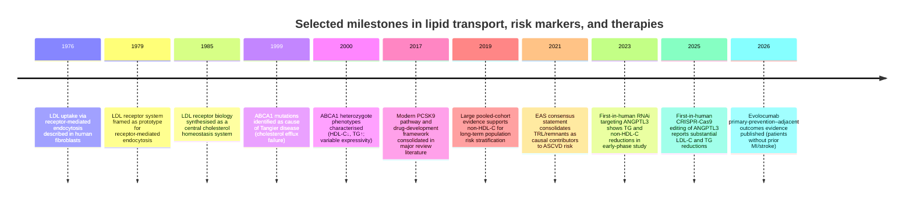
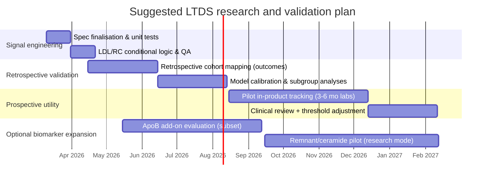

# Lipid Transport Dysfunction Signal: Evidence Review, Mechanistic Pathways, Biomarkers, and an Implementable Standard-Lipid-Panel Algorithm

## Executive summary

Lipid transport dysfunction is best understood clinically as a **mismatch between lipid trafficking capacity (lipoprotein production, lipolysis, remodelling, and clearance) and metabolic demand**, producing an **atherogenic particle burden** (apoB-containing lipoproteins) plus **triglyceride-rich lipoprotein (TRL) / remnant accumulation**. The attached brief’s “foundational signal” goal is practical: **detect this dysfunction early using widely available fasting lipid panels**, in a way that is clinically defensible and aligned with outcome data. fileciteturn0file0

The most defensible “standard lipid panel only” detection approach is a **two-axis signal**:

1) **Atherogenic particle burden proxy**: **non-HDL-C = total cholesterol − HDL-C**. Non-HDL-C captures cholesterol carried by *all* atherogenic apoB-containing particles (LDL, IDL, VLDL remnants, Lp(a) cholesterol content to a degree) and is strongly associated with long-term ASCVD outcomes in large pooled cohorts with long follow-up. citeturn9search1turn9search5turn8search3  
2) **TRL/remnant stress proxy**: **fasting triglycerides (TG)** (and, where feasible, **calculated remnant cholesterol**). TG-rich lipoproteins and remnants have strong epidemiologic, mechanistic, and genetic support as contributors to ASCVD risk and residual risk. citeturn10search1turn10search2turn24view0turn10search5

ApoB itself is often the best single metric of atherogenic particle number, and discordance studies repeatedly show apoB outperforms LDL-C (and frequently non-HDL-C), but **apoB is not reliably available from a standard lipid panel**. Therefore, this report recommends **non-HDL-C as the primary standard-panel signal**, with **TG (± remnant cholesterol)** as the standard-panel detection of “lipid transport dysfunction” driven by TRL overproduction/clearance defects. citeturn0search2turn5search7turn0search0turn10search1

The hard truth: **not all TG-lowering is event-lowering** (e.g., pemafibrate lowered TG/remnants but did not reduce CV events in PROMINENT), so the signal should not treat “TG down” as automatically “risk down” unless **apoB/non-HDL-C and remnant biology** move in the right direction. citeturn17search6turn12search1turn10search1

## Evidence from provided documents

Only one document was accessible in the materials available here. Other “shared folder” documents were not available to this environment, so they cannot be synthesised or summarised individually. fileciteturn0file0

**Document summary (accessible)**  
- **Type**: Internal research brief (foundational study / requirements document). fileciteturn0file0  
- **Date**: Not stated. fileciteturn0file0  
- **Authors**: Not stated (appears to be an internal rewrite of a prior over-prescriptive brief). fileciteturn0file0  
- **Key findings / requirements**:  
  - Defines lipid transport dysfunction as foundational to cardiometabolic risk assessment and upstream of events; highlights patterns: high TG, low HDL-C, apoB particle burden, small dense LDL, remnant accumulation. fileciteturn0file0  
  - Imposes strict constraints: compute the signal from standard fasting lipid panels; prefer Tier-1 evidence (prospective cohorts, meta-analyses, guideline alignment, hard outcomes). fileciteturn0file0  
  - Specifies implementation expectations: deterministic formula, evidence-based thresholds, explicit tiering, unit conversion handling, and missing-data fallbacks. fileciteturn0file0  
- **Limitations of the document**:  
  - It is a *requirements and question* document, not primary evidence; it does not provide datasets, systematic search results, or validated thresholds itself. fileciteturn0file0  
  - It implicitly assumes that lipid-panel–derived proxies can robustly stand in for apoB particle number; this is often true directionally but requires explicit validation. fileciteturn0file0turn0search2turn5search7

## Lipid transport mechanisms and dysfunction literature

### Core transport architecture

Blood lipid transport is dominated by **lipoprotein trafficking**: gut-derived apoB48 particles (chylomicrons) and liver-derived apoB100 particles (VLDL → IDL → LDL), counterbalanced by HDL-mediated reverse cholesterol transport (RCT). This is not just “carrying fat”; it is a regulated transport network controlling lipid delivery, storage, and clearance. citeturn10search1turn21search6

Seminal mechanistic work established **LDL receptor–mediated endocytosis** as a prototype system for cholesterol homeostasis: high-affinity LDL binding at the surface, internalisation via coated pits, delivery of cholesterol, and feedback suppression of cellular cholesterol synthesis. citeturn21search5turn21search6turn6search2

On the “export/efflux” side, discovery of **ABCA1** mutations as the cause of **Tangier disease** (extremely low HDL due to defective cellular cholesterol efflux) anchored ABCA1 as a core RCT gateway. Human ABCA1 mutation carriers show characteristic lipid phenotypes (low HDL-C, altered TG) and variable clinical expression. citeturn21search0turn6search0

### Atherogenic dyslipidaemia as a transport phenotype

The contemporary “lipid transport dysfunction” phenotype that matters most for metabolic disease is often described as **atherogenic dyslipidaemia**: elevated fasting/post-prandial TG, increased apoB burden, remnant accumulation, small dense LDL, and low HDL-C—commonly in insulin resistance/type 2 diabetes and central obesity. The **2019 European dyslipidaemia guideline** explicitly frames this cluster in metabolic syndrome and type 2 diabetes, emphasising non-HDL-C and apoB as useful secondary targets reflecting TRLs/remnants. citeturn0search0

Mechanistically, insulin resistance and hyperglycaemia can drive hepatic de novo lipogenesis via SREBP-1c and ChREBP, increasing hepatic lipid substrate and VLDL secretion; lipogenesis may also produce lipotoxic intermediates (diacylglycerols, ceramides) that reinforce insulin resistance—creating a feed-forward loop linking transport dysfunction to signalling dysfunction. citeturn3search9

### Research milestones timeline

Key milestones that underpin today’s “lipid transport dysfunction” interpretation are summarised below (selected, not exhaustive). citeturn21search5turn21search6turn6search2turn21search0turn6search0turn3search8turn3search6turn18search1turn20search0



image_group{"layout":"carousel","aspect_ratio":"16:9","query":["lipoprotein metabolism VLDL LDL HDL diagram","reverse cholesterol transport ABCA1 ABCG1 schematic","triglyceride-rich lipoprotein remnants atherosclerosis diagram"],"num_per_query":1}

## Molecular pathways connecting lipid transport to signalling dysfunction

### Conceptual mechanism: transport overload becomes inflammatory and insulin-signalling pathology

Transport dysfunction is not merely “too much lipid”. It changes the **composition, residence time, and arterial-wall interactions** of apoB particles and remnants, which can trigger pattern-recognition signalling and inflammasome activity in vascular and immune cells. The European Atherosclerosis Society consensus statement emphasises that TRL/remnants contribute to lesion initiation/progression via retention, inflammation, cholesterol deposition, and foam cell formation. citeturn10search1turn10search2

Oxidatively modified lipoproteins can activate inflammatory cascades (for example, NLRP3 inflammasome activation leading to IL-1β/IL-18 signalling), while HDL can show countervailing effects in some contexts. citeturn11search7turn11search3

In metabolic tissues, lipid oversupply and hepatic lipogenesis can generate signalling lipids (DAGs, ceramides) that impair insulin signalling, reinforcing the transport phenotype (more VLDL secretion, more remnants). Human mechanistic work in NAFLD demonstrates relationships between insulin resistance and hepatic DNL, and explicitly notes the plausibility of DNL-derived DAG/ceramides contributing to insulin resistance (positive feedback). citeturn3search9

### Pathway map: from insulin resistance to remnants to vascular inflammation

```mermaid
flowchart TD
  A[Insulin resistance & hyperglycaemia] --> B[Hepatic DNL via SREBP-1c/ChREBP]
  B --> C[Hepatic VLDL-TG overproduction]
  A --> D[Adipose lipolysis → FFA flux to liver]
  D --> C
  C --> E[Circulating TG-rich lipoproteins (VLDL/CM remnants)]
  E --> F[Impaired lipolysis & clearance\n(LPL inhibition, remnant residence time ↑)]
  F --> G[Remnant cholesterol burden ↑]
  G --> H[Arterial wall retention & uptake]
  H --> I[Macrophage lipid loading & foam cells]
  I --> J[Inflammatory signalling\n(NF-κB, NLRP3 → IL-1β/IL-18)]
  J --> K[Endothelial dysfunction & plaque progression]
```

This diagram reflects a synthesis of established relationships: hepatic DNL regulation by insulin/glucose transcriptional programmes, TRL/remnant generation and atherogenicity, and inflammasome-related inflammatory outputs in atherosclerosis. citeturn3search9turn10search1turn11search7

### Regulatory RNA and “signalling inside transport”

MicroRNAs such as **miR‑33** regulate cholesterol efflux capacity by targeting ABCA1 and intersecting with autophagy/mitochondrial energy status—mechanisms that affect cholesterol mobilisation and efflux in macrophage foam cells. Animal and cell studies show miR‑33 can suppress lipid droplet catabolism and cholesterol efflux, while inhibition can restore defective autophagy and reduce lesion features in atherosclerotic mouse models. citeturn2search0turn2search5turn2search3

This matters for a “dysfunction signal” because it reinforces that transport metrics (e.g., HDL-C) can be **misleading**: HDL quantity is not equivalent to HDL function (cholesterol efflux capacity), and genetic or inflammatory contexts can decouple HDL-C from protective biology. Large population data also show very high HDL-C can associate with increased mortality in some subgroups, underscoring why HDL-C should be treated as a contextual marker, not a primary target. citeturn7search2turn10search1

## Biomarkers and assays, including a standard lipid panel signal specification

### The minimal standard-panel biomarker set

A standard fasting lipid panel typically includes total cholesterol (TC), HDL-C, triglycerides (TG), and LDL-C (often calculated). The brief requires a signal computable from these ubiquitous inputs. fileciteturn0file0

From these, the most robust derived measures are:

- **Non-HDL-C (primary)** = TC − HDL-C. Strong long-term outcome association in very large pooled cohorts; widely recommended as a secondary target in European guidance and frequently used when TG is elevated or LDL-C is less reliable. citeturn9search1turn0search0turn0search4  
- **Triglycerides (secondary)**: reflects TRL burden/handling; used as a risk enhancer and a prompt to evaluate remnant/transport dysfunction, though TG-lowering does not automatically translate to event reduction depending on mechanism and concurrent apoB/non-HDL changes. citeturn12search5turn10search1turn17search6  
- **Calculated remnant cholesterol (optional)** = TC − LDL-C − HDL-C *if LDL-C is measured directly or calculated with an equation valid in the TG range*. High remnant cholesterol predicts MI in large cohorts and appears relevant across BMI strata. citeturn24view0turn10search1  
- **TG/HDL-C ratio (supporting)**: associated with cardiovascular events in meta-analysis and is often interpreted as an insulin-resistance surrogate, but its incremental value beyond non-HDL/apoB varies and thresholds are less standardised. citeturn7search0turn12search5

### Practical assay caveat: LDL-C calculation error

If LDL-C is calculated (e.g., Friedewald-like approaches), accuracy degrades with hypertriglyceridaemia and low LDL-C. A newer equation (Sampson et al.) improved LDL-C estimation against β-quantification and can be used up to TG ≈800 mg/dL, but clinical panels may not implement it consistently. For a platform signal, this argues for making **non-HDL-C the anchor** and treating remnant cholesterol as *conditional*. citeturn4search4turn0search4

### Candidate biomarkers beyond the standard panel

These are biologically and clinically relevant but typically require add-on assays:

- **Proteins / lipoprotein markers**: apoB (particle number proxy), apoC-III and ANGPTL3 (TRL catabolism regulators), Lp(a) (causal risk factor, once-in-life testing often recommended), LDL-TG / RLP-C (specialised TRL metrics). citeturn0search2turn3search2turn5search5turn10search1  
- **Lipid species (lipidomics)**: ceramides and related sphingolipids have validated risk scores (e.g., ceramide–phospholipid scores) that predict residual risk in CAD cohorts and trials when measured by LC–MS/MS. citeturn11search2turn11search6turn11search5  
- **RNAs**: miR‑33 and other lipid-metabolism miRNAs have mechanistic relevance to efflux/autophagy and show disease associations in experimental systems; most are not mature clinical assays for routine CV risk stratification. citeturn2search0turn2search5

### Recommended signal as an implementable algorithm

The goal is **detection** of lipid transport dysfunction early, not full ASCVD risk prediction (which also needs BP, smoking, age, diabetes, etc.). The signal therefore prioritises transport biology and measurement robustness.

**Signal name**: Lipid Transport Dysfunction Signal (LTDS)

**Required biomarkers (minimum)**: fasting TC, HDL-C, TG. (LDL-C optional; not required.) fileciteturn0file0

**Core calculations (unit-invariant; works in mg/dL or mmol/L)**  
- Non-HDL-C = TC − HDL-C citeturn9search1turn0search0  
- TG category = based on fasting TG citeturn12search5turn0search0  
- Optional: Remnant cholesterol (RC) = TC − HDL-C − LDL-C (only if LDL-C is directly measured or reliably estimated for the TG range) citeturn24view0turn4search4  

**Output tiers (three-level classification)**  
This triage intentionally reflects: (i) strong long-term outcome gradients for non-HDL-C and (ii) clinically meaningful TG cut-offs widely used for risk enhancement and hypertriglyceridaemia management.

- **Optimal / no clear dysfunction signal**
  - Non-HDL-C < 3.7 mmol/L (<145 mg/dL) **and** TG < 1.7 mmol/L (<150 mg/dL).  
  Rationale: the Multinational Cardiovascular Risk Consortium shows stepwise long-term event-rate increases beginning above the lowest non-HDL-C categories; TG <150 mg/dL is repeatedly treated as “lower risk” in European guidance (without asserting a hard outcome-derived TG “goal”). citeturn9search1turn0search0turn10search1  

- **Suboptimal / emerging dysfunction signal**
  - Either:
    - Non-HDL-C 3.7–5.69 mmol/L (145–219 mg/dL), **or**
    - TG 1.7–5.6 mmol/L (150–499 mg/dL).  
  Interpretation: compatible with early/established atherogenic particle excess and/or TRL handling stress; warrants deeper phenotyping (apoB, Lp(a), glycaemic markers, liver-metabolic context) if available. citeturn9search1turn12search5turn10search1turn0search4  

- **At risk / high dysfunction signal**
  - Any of:
    - Non-HDL-C ≥ 5.7 mmol/L (≥220 mg/dL), consistent with high long-term event rates in pooled cohorts, **or**
    - TG ≥ 5.6 mmol/L (≥500 mg/dL), where acute pancreatitis risk becomes a dominant clinical concern and urgent evaluation of secondary causes and genetics becomes relevant. citeturn9search1turn12search5  

**Optional remnant cholesterol “flag” (additive, not required)**  
If RC is available and **RC ≥1.5 mmol/L (≥58 mg/dL)**, flag “high remnant burden”: this cut-off was associated with ~2-fold MI risk in a >100k-person cohort with up to 11 years follow-up. citeturn24view0turn10search1  

**Missing data handling**
- If LDL-C is missing or TG is high enough to make LDL-C unreliable, **skip RC** and rely on non-HDL-C + TG. citeturn4search4turn0search4  
- If fasting status is unknown, interpret TG/RC conservatively; non-HDL-C remains interpretable but may be less comparable across measurement contexts. (European guidance increasingly accepts non-fasting lipids for many purposes, but the brief’s spec is fasting, so LTDS should default to fasting.) fileciteturn0file0turn0search0  

**What LTDS is (and is not)**
- It is a **transport phenotype detector** anchored to non-HDL-C and TG, not a full ASCVD calculator. citeturn9search1turn10search1  
- It does not assume HDL-C is protective on its own; HDL-C is used for non-HDL calculation and context only. citeturn7search2turn10search1

### Table comparing key studies

| Citation | Model | Main finding | Sample size | Methods | Limitations |
|---|---|---:|---:|---|---|
| Multinational Cardiovascular Risk Consortium (Lancet 2019) citeturn9search1turn9search5 | Pooled prospective cohorts | Non-HDL-C strongly associated with long-term ASCVD risk; enables risk modelling to age 75 | 398,846; 54,542 endpoints; median follow-up 13.5y | Pooled cohort analyses, Cox models, derivation/validation | Heterogeneous cohorts; observational; treatment changes over decades |
| “ApoB vs LDL-C vs non-HDL-C” meta-analysis (Circulation 2011) citeturn0search2 | Meta-analysis of epidemiologic studies | ApoB strongest risk marker; non-HDL-C intermediate; LDL-C weakest | 233,455; 22,950 events | Standardised relative risk comparisons, random-effects meta-analysis | Method heterogeneity; biomarkers not measured uniformly |
| Copenhagen General Population Study (Clin Chem 2018) citeturn24view0 | Prospective population cohort | Higher remnant cholesterol strongly associated with MI across BMI strata | 106,216; 1,565 MI; up to 11y | Calculated RC categories; Cox models; BMI stratification | RC depends on LDL-C estimation; observational residual confounding possible |
| Obesity→IHD mediation MR (Circ Res 2015) citeturn10search5 | Mendelian randomisation + mediation | Obesity→IHD partly mediated by remnant cholesterol and LDL-C; inflammation marker CRP not mediator genetically | ~90,000; 13,945 IHD; ≤22y | Genetic instruments, mediation analysis | MR assumptions; mediator definitions; generalisability |
| EAS TRL/remnant consensus (Eur Heart J 2021) citeturn10search1turn10search2 | Consensus synthesis | TRLs/remnants have strong genetic/epi/mechanistic support as causal contributors to MI/ischaemic stroke; highlights measurement gaps | N/A | Narrative synthesis; proposed definitions, pathways | Not an RCT; depends on underlying literature quality |
| ESC/EAS dyslipidaemia guideline (Eur Heart J 2019) citeturn0search0 | Guideline | Non-HDL-C and apoB “secondary goals”; TG <150 mg/dL indicates lower risk (no TG goal established) | N/A | Evidence grading, guideline methodology | Targets partly inferred; not all secondary goals validated in RCTs |
| UK Biobank + Copenhagen PAD pathway study (2022 publication) citeturn0search3 | Cohort + replication | ApoB→PAD risk explained mainly by remnant cholesterol rather than LDL-C | Copenhagen: ~15y follow-up; replication: 302,167 UK Biobank | Standard lipid–derived remnant/LDL; NMR subcohort | Observational; PAD ascertainment and statin use patterns matter |
| TG/HDL-C ratio meta-analysis (2022) citeturn7search0 | Meta-analysis of cohorts | Higher TG/HDL-C associated with higher CV events | 207,515; 13 studies | Systematic review + pooled HRs | Publication bias; heterogeneity; thresholds not standard |
| LDL-C equation (JAMA Cardiol 2020) citeturn4search4 | Retrospective method development + validation | New LDL-C equation improves accuracy vs Friedewald, including higher TG (≤800 mg/dL) | Training/validation on NIH β-quantification datasets; external validation >250k noted | Regression modelling against β-quantification | Implementation not universal; still an estimate; atypical dyslipidaemias excluded |
| PROMINENT (NEJM 2022) citeturn17search6turn12search1 | RCT (TG lowering) | Pemafibrate lowered TG/remnants but did not reduce CV events; apoB/LDL-C increased slightly | 10,497; median follow-up 3.4y | Double-blind RCT; MACE endpoint | TG lowering mechanism may not reduce apoB burden; population-specific |
| REDUCE-IT (clinical trial summary) citeturn14search0turn14search4 | RCT (EPA therapy) | Icosapent ethyl reduced MACE in statin-treated patients with elevated TG | 8,179; median follow-up 4.9y | Double-blind RCT; adjudicated endpoints | Mechanism debated; increased AF/bleeding signals; not “pure TG lowering” |
| VESALIUS-CV (NEJM 2026) citeturn20search0turn20search2 | RCT (PCSK9 inhibition) | Evolocumab reduced first major CV events in high-risk adults without prior MI/stroke | 12,257 | Double-blind RCT; 3- and 4-point MACE | Majority White; cost/access considerations; not “general population” |
| ANGPTL3 RNAi phase 1 (Nat Med 2023) citeturn3search6 | Phase 1 (RNAi) | ANGPTL3 knockdown lowered TG and non-HDL-C in early human study | 52 healthy + 9 hepatic steatosis cohort | Basket trial cohorts; biomarker endpoints | No outcomes yet; short follow-up |
| ANGPTL3 CRISPR editing phase 1 (NEJM 2025) citeturn18search1 | Phase 1 (gene editing) | Single-dose ANGPTL3 editing reduced LDL-C and TG substantially at higher doses | 15 | Ascending-dose phase 1; safety primary | Very early; long-term safety/outcomes unknown; small n |

## Disease associations, clinical phenotypes, and therapeutics

### Disease associations and phenotypes

The lipid transport dysfunction pattern described in the brief aligns strongly with **ASCVD phenotypes**: coronary artery disease, myocardial infarction, ischaemic stroke, and peripheral artery disease, where apoB-containing lipoproteins and TRL/remnants contribute to plaque development and vascular events. citeturn10search1turn0search3turn9search1

It is also closely tied to cardiometabolic disease phenotypes, including **type 2 diabetes progression** and **fatty liver disease**, now commonly termed **MASLD/MASH** following a multi-society Delphi process and adoption by major liver societies. MASLD is conceptually consistent with hepatic lipid-handling overload and VLDL overproduction in insulin resistance. citeturn6search3turn6search4turn3search9

At the severe end of TG transport failure (often genetic or secondary-cause driven), hypertriglyceridaemia can confer risk of **acute pancreatitis**, which changes clinical priorities from long-term ASCVD risk to immediate TG reduction and secondary-cause evaluation. This is explicitly acknowledged in contemporary hypertriglyceridaemia guidance. citeturn12search5

### Therapeutic targets and interventions under investigation

Interventions map onto transport “control points”:

- **Lower apoB particle burden / LDL pathway**: statins, ezetimibe, bempedoic acid (event reduction shown in CLEAR Outcomes), PCSK9 inhibition (event reduction in high-risk populations; now including patients without prior MI/stroke in VESALIUS-CV). citeturn14search2turn20search0turn4search3turn3search8  
- **Address TRL/remnant metabolism**: apoC-III and ANGPTL3 targeting (antisense/siRNA) reduces TG and can reduce apoB/non-HDL in some studies; however, definitive event outcomes for these newer agents remain under development. citeturn13search3turn3search6turn1search5turn10search1  
- **TG-lowering that did *not* translate into event reduction in a key setting**: pemafibrate in PROMINENT (TG down, events unchanged), illustrating that mechanism and apoB changes matter. citeturn17search6turn12search1  
- **Omega-3 pathway (not purely TG)**: icosapent ethyl reduced MACE in REDUCE-IT, but interpretation involves biology beyond TG lowering (and safety signals like AF/bleeding). citeturn14search0turn14search4

Emerging modalities include one-time gene editing of ANGPTL3 (phase 1), which is scientifically striking but still too early for any outcome-based conclusions and requires long-term safety surveillance. citeturn18search1

## Knowledge gaps and recommended research programme

### What remains genuinely unresolved

1) **Standardisation of “remnant” measurement**: there is broad agreement that TRL/remnants matter, but the field still lacks a single universally adopted, routine assay for remnant particles; calculated remnant cholesterol is convenient but inherits LDL-C estimation error and lab-method variability. citeturn10search2turn4search4  
2) **Causal-to-actionable bridge for TG/remnants**: genetics and observational data support remnant causality, but RCT translation depends on whether the intervention meaningfully reduces atherogenic particle exposure (apoB/non-HDL) and remnant residence time without offsetting harms. PROMINENT is the cautionary example. citeturn10search1turn17search6  
3) **HDL quantity vs function**: HDL-C is not a reliable “protective” target; future signals may need HDL function proxies (cholesterol efflux capacity), but these are not standard clinical tests. citeturn7search2turn6search0turn2search0  
4) **Population calibration for a consumer platform**: non-HDL-C has strong long-term gradients, but how to convert those gradients into an app-friendly “dysfunction tier” while avoiding over-medicalisation still needs careful product validation, ideally against hard outcomes. citeturn9search1turn0search0

### Prioritised research questions

A focused research agenda that matches the brief’s constraints looks like:

- **RQ1**: In your target user base, does LTDS (non-HDL + TG tiers) predict *future* ASCVD events beyond LDL-C categories, using consistent endpoint definitions? citeturn9search1turn0search2turn10search1  
- **RQ2**: How often does an apparently “acceptable” LDL-C coexist with high non-HDL-C/TG (discordance scenarios), and which subgroup has the highest event risk? citeturn5search7turn0search3turn20search0  
- **RQ3**: Does adding “optional RC flag” improve prediction/calibration materially, and under what TG/LDL calculation regimes does it backfire? citeturn24view0turn4search4turn0search4  
- **RQ4**: Can LTDS tiers track intervention response in a way that is consistent with outcome evidence (e.g., non-HDL reduction correlating with improved risk proxy, while TG-only lowering without apoB/non-HDL improvement is treated cautiously)? citeturn9search1turn17search6turn14search0turn20search0  

### Recommended next experiments, timelines, and resources

The fastest path to a defensible platform “signal” is staged validation: first analytic validity (math, units, edge cases), then clinical validity (association with risk/outcomes), then clinical utility (does it change decisions or improve outcomes).



Resource estimate (order-of-magnitude, not budgeted):  
- 1 data scientist/biostatistician (0.5–1.0 FTE for 6–9 months) for cohort linkage, calibration, and validation.  
- 1 clinical lipidology advisor (0.1–0.2 FTE) for threshold defensibility and edge-case governance aligned with major guidelines. citeturn0search0turn4search1turn12search5  
- 1 software engineer (0.25–0.5 FTE for 2–3 months) for deterministic implementation, unit conversion, and lab-format robustness.  
- Optional: collaborations with a cohort-holding institution (for outcomes linkage) and/or a lab partner for apoB add-on evaluation, because apoB is consistently supported as a superior marker when discordant but is not guaranteed in standard panels. citeturn5search7turn0search4turn9search1  

Actionable “next step” recommendations (platform-facing):
- Ship LTDS v1 anchored to **non-HDL-C + TG tiers**, with conspicuous conditionality around RC (only compute when reliable). citeturn9search1turn4search4  
- Add an “advanced mode” pathway that upgrades the signal when **apoB** is available (or can be ordered), because the evidence base for apoB superiority is strong in discordance analyses. citeturn0search2turn5search7  
- Explicitly warn users that “TG lowering ≠ risk lowering” unless apoB/non-HDL and remnant exposure move down; treat TG-only improvements cautiously, consistent with PROMINENT vs REDUCE-IT divergence. citeturn17search6turn14search0turn10search1  

## Methods appendix

This report used a “brief-to-evidence” workflow: (i) extract implementation constraints and research questions from the provided brief, (ii) identify outcome-validated lipid measures suitable for standard panels, (iii) map those measures onto mechanistic pathways and clinically actionable thresholds, and (iv) cross-check against major guidelines and major trials. fileciteturn0file0

**Databases and sources searched (English-language)**  
Primary biomedical indexing and official sources were prioritised: PubMed/NCBI records for primary studies and RCTs; guideline publisher sites and major cardiology/lipid society sites for official recommendations; and high-impact journal records where accessible. citeturn9search1turn20search0turn17search6turn0search0turn10search1

**Illustrative keyword families (combined with AND/OR)**  
- “non-HDL cholesterol” AND (“cardiovascular events” OR “long-term risk” OR “cohort”) citeturn9search1  
- “apolipoprotein B” AND (“discordance” OR “LDL-C” OR “non-HDL-C”) citeturn5search7  
- “remnant cholesterol” AND (“myocardial infarction” OR “Mendelian randomization” OR “UK Biobank”) citeturn24view0turn0search3turn10search5  
- “triglyceride-rich lipoproteins” AND (“consensus statement” OR “atherosclerosis”) citeturn10search1  
- “LDL-C equation” AND (“Sampson” OR “β-quantification”) citeturn4search4  
- Trial names and mechanisms (e.g., “PROMINENT pemafibrate”, “REDUCE-IT icosapent”, “VESALIUS-CV evolocumab”, “ANGPTL3 RNAi”, “APOC3 antisense”) citeturn17search6turn14search0turn20search0turn3search6turn13search3  

**Inclusion approach**  
- Prioritised: prospective cohorts with large N and long follow-up, meta-analyses, Mendelian randomisation/causal inference where relevant, and RCTs with hard cardiovascular outcomes. citeturn9search1turn0search2turn10search5turn20search0turn17search6  
- Included older “seminal” mechanistic papers when needed to ground transport biology (LDL receptor; ABCA1/Tangier disease). citeturn21search5turn21search0turn6search0